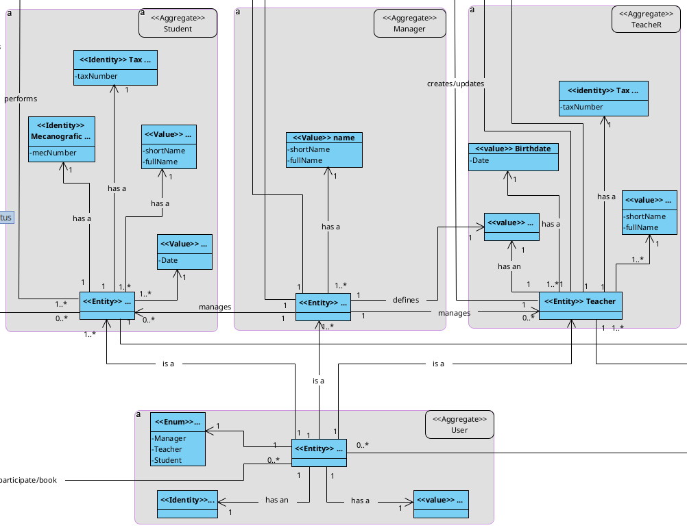
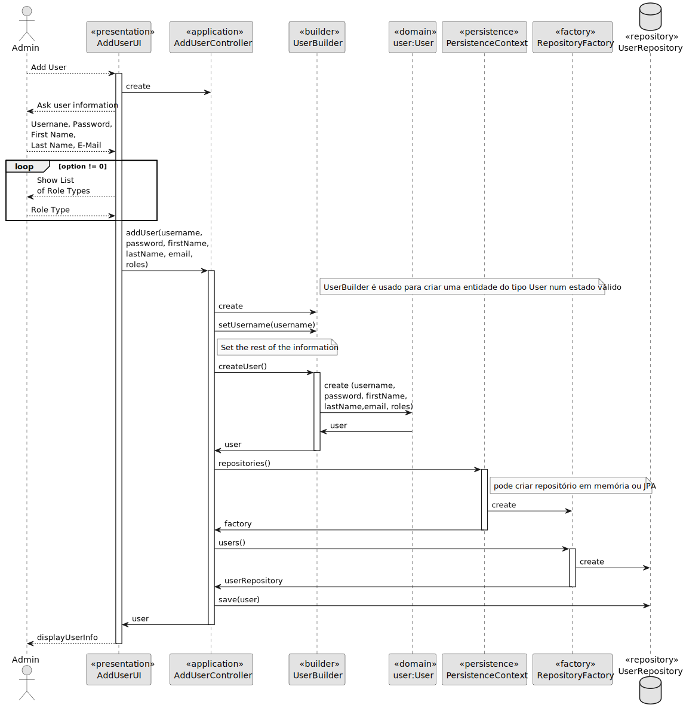
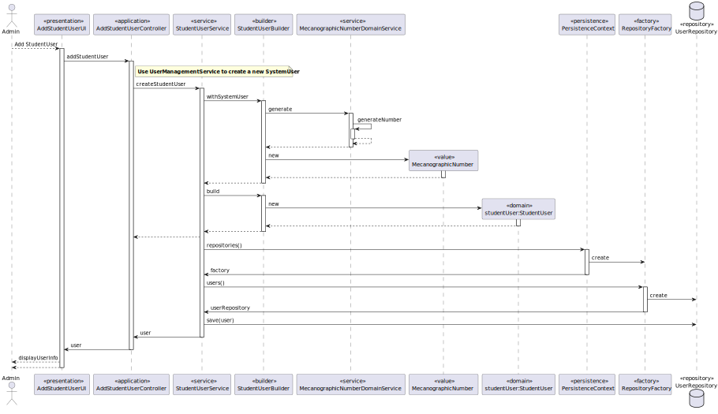

# US 00001 - Register, disable/enable, and list users of the system (Teachers and Students, as well as Managers)

## 1. Requirements Engineering

### 1.1. User Story Description

As Manager, I want to be able to register, disable/enable, and list users of the system (Teachers and Students, as well as Managers)

### 1.2. Customer Specifications and Clarifications

**From the specifications document:**

> This set of functionalities related to the management of users, It should be only available to
managers of the system.

>	A Teacher is characterized by his/her name, date of birth, tax payer number and an acronym
inputed by the administrator (e.g., "AALB").

>	A student is characterized by his/her name, date of birth, tax payer number and a mechanographic number assigned automatically by the system based on the year of registration and a
sequential number, e.g., "202300001".

**From the client clarifications:**

> **Question:**
>"Dear client,
>We don't have any constraint to the teachers acronym on the system specifications documents.
>Will it be possible to have two differents with the same acronym? Will there be a maximum length to a taacher acronym? 
> Are there any other details to be add to this topic?"

> **Answer:** 
> "Regarding this topic mu opinion is that the teacher acronym could be used to identify the teacher, therefore it should be unique."
>"Following the example given, it seems the acronym should be formed by a sequence of capital letters. There is really no maximum number of characters, but I would provide the possibility of setting a maximum as a property configuration of the system (with a default value). Maybe this is a good rule for every similar case."

> **Question:**
>Does the Manager have the same attributes as Students and Teachers? (tay payer number, name)
>Is the name of each actor either the full name or the short name?

> **Answer:**
>Hello.
>A manager should have only the attributes as described in section 5.1.1.
Also in section 5.1.1: "All users should be identified in the system by their email.". 
> It is also stated that "Each user should also provide its full name and short name". 
> As mentioned before, the short name is like a given name, the short name someone chooses to be called.
> Therefore, all users should have a name (full name) and a short name. When later, 
> the document refers that students and teachers should have names, please consider both full name and short name (since both are users)."

> **Question:**
> should the user be multi-role? For example, can a system user be a teacher and a student or a manager at the same time?
> **Answer:**
> I see no need for that. For me, each user as only one specific role in the system.

> **Question:**
> Do the system has to support an option to create new user roles that are not specified at the system specification documents or the system will always have just the three user roles described?
> **Answer:**
>the solution should support the ones necessary to cover all the actual functional requirements.

### 1.3. Acceptance Criteria

* none

### 1.4. Found out Dependencies

### 1.5 Input and Output Data

**Input Data:**

* Typed data:
    * name
    * email
    * short name
    * full name

* Typed data - Teacher:
    * acronym
    * tax payer number
    * date of birth

* Typed data - Student:
   * date of birth, 
   * tax payer number

**Output Data:**

* (In)Success of the operation

### 1.6. System Sequence Diagram (SSD)

### 1.7 Other Relevant Remarks

* 

## 2. OO Analysis

### 2.1. Relevant Domain Model Excerpt

### 2.2. Other Remarks

n/a

## 3. Design - User Story Realization

**SSD**

### Systematization ##

The conceptual classes promoted to software classes are:

* TeacherUser
* StudentUser
* SystemUser

Other software classes (i.e. Pure Fabrication) identified:

* UserStoryUI
* UserStoryController
* Builder
* Repository
* Service

## 3.2. Sequence Diagram (SD)

## 3.3. Class Diagram (CD)

# 4. Tests 

**Test 1:** Check that it is not possible to create an instance of the Task class with null values. 

	@Test(expected = IllegalArgumentException.class)
		public void ensureNullIsNotAllowed() {
		Task instance = new Task(null, null, null, null, null, null, null);
	}
	

**Test 2:** Check that it is not possible to create an instance of the Task class with a reference containing less than five chars - AC2. 

	@Test(expected = IllegalArgumentException.class)
		public void ensureReferenceMeetsAC2() {
		Category cat = new Category(10, "Category 10");
		
		Task instance = new Task("Ab1", "Task Description", "Informal Data", "Technical Data", 3, 3780, cat);
	}

# 5. Construction (Implementation)

## Class 

## Class 

# 6. Integration and Demo 

# 7. Observations

