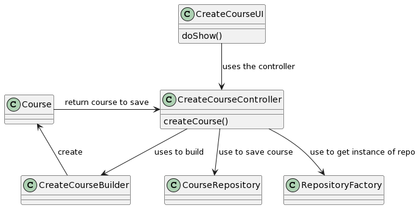
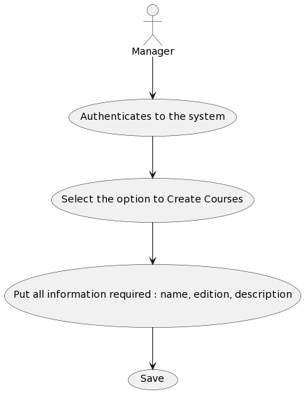
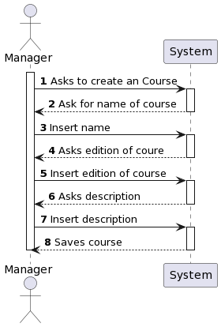
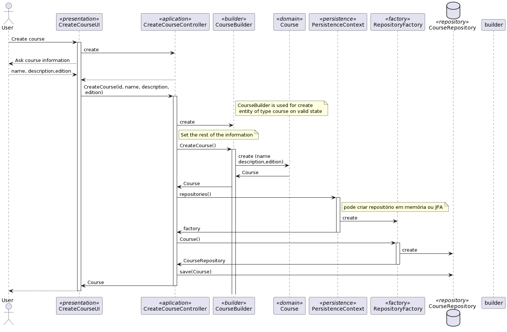

# US 1002 As Manager, I want to create courses

## 1. Context

*FRC01 - Create Course Different editions of a course are to be considered different courses (e.g., Intro-Math-Sem01, Intro-Math-Sem02). Only managers are able to execute this functionality.*

## 2. Requirements

**US 1002** As Manager, I Want to create courses

- US 1002.1. -Create Course Different editions of a course are to be considered different courses (e.g., Intro-Math-Sem01, Intro-Math-Sem02). 
                Only managers are able to execute this functionality.

## 3. Analysis

**input Data:**
* Typed Data:
    * name
    * description
    * edition
  
**Output Data:**
* Course is created and save on repository

## Class diagram

## Use case diagram

## System sequence diagram

## 4. Design

*In this sections, the team should present the solution design that was adopted to solve the requirement. This should include, at least, a diagram of the realization of the functionality (e.g., sequence diagram), a class diagram (presenting the classes that support the functionality), the identification and rational behind the applied design patterns and the specification of the main tests used to validade the functionality.*
*Rational*

| Interaction ID | Question: Which class is responsible for... | Answer                                      | Justification (with patterns)|
|:---------------|:--------------------------------------------|:--------------------------------------------|:-----------------------------|
| Step 1| ... interacting with the actor?             | CreateCourseUI                              | |
| | ... coordinating the US?                    | CreateCourseController                      | |
| Step 2| Create Course?| CourseBuilder                               | Create a course on a valid state|
|Step 3| Saving the course| CreateCourseController / PersistenceContext | |
|Step 4| show course information for user| CreateCourseUI                              | |


### 4.1. Realization


### 4.2. Sequence diagram



### 4.3. Applied Patterns

In the implementation of this US the following DDD patterns were used:
- **Factory** : The "Repository factory" is responsible for creating instances of the "CourseRepository" repository.
- Builder** : Using the "CourseBuilder" ensures that the course object is always created in a valid state.
- **Repository**: The "CourseRepository" is responsible for persisting the data to the database.
- Entity**: The "Course" is an entity that has its own attributes (name, state, edition and description).
### 4.4. Tests

**testIfDesignationIsCorrect:** *Checks that the course name is correct.*

```
    @Test
    public void testIfDesignationIsCorrect() {
        assertEquals(name1, course1.designation().toString());
        assertEquals(name2, course3.designation().toString());
    }
````

**testIfDescriptionIsCorrect:** *Checks that the course description is correct.*
```
    @Test
    public void testIfDescriptionIsCorrect() {
        assertEquals(description1, course1.description().toString());
        assertEquals(description2, course3.description().toString());
    }
````

**testIfEditionIsCorrect:** *Checks that the course edition is correct.*

```
    @Test
    public void testIfEditionIsCorrect() {
        assertEquals(edition1, course1.edition().toString());
        assertEquals(edition2, course3.edition().toString());
    }
````
**testIfStateIsCorrect:** *Checks that the course state is correct.*

```
    @Test
    public void testIfStateIsCorrect() {
        assertEquals(state1, course1.state().toString());
        assertEquals(state1, course3.state().toString());
    }
````
**testIFCourseIsEqualToAnotherCourse:** *Checks if course is equal to another.*

```
    @Test
    public void testIFCourseIsEqualToAnotherCourse() {
        assertTrue(course2.sameAs(course2));
        assertFalse(course2.sameAs(course3));
        assertFalse(course1.sameAs(course3));
    }
````

## 5. Implementation


## 6. Integration/Demonstration


## 7. Observations

