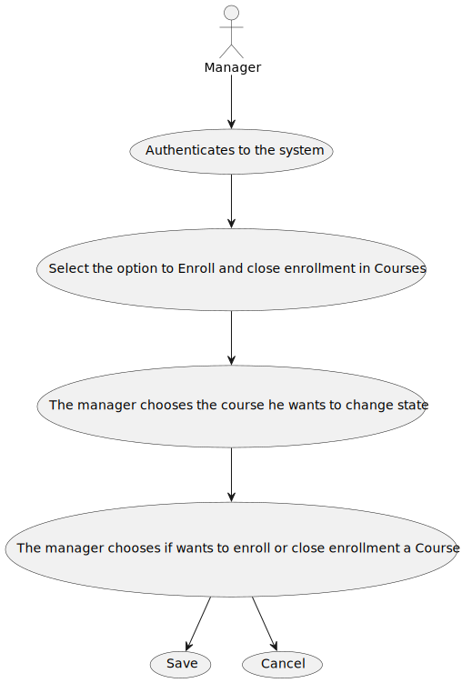
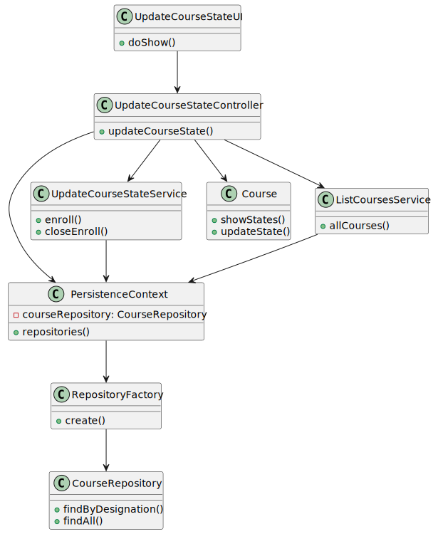
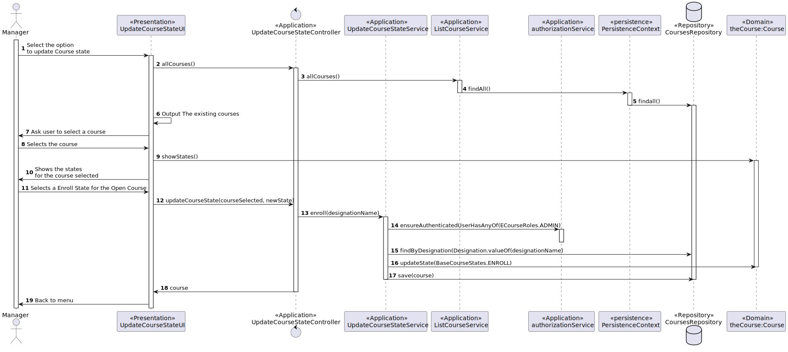
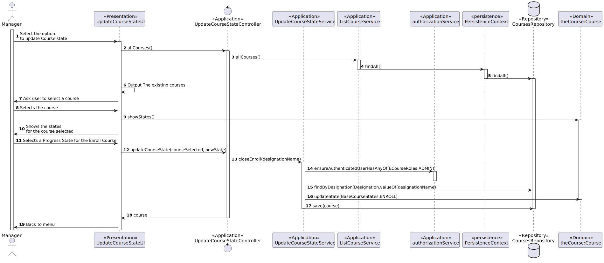

# US 1003 - As Manager, I want to open and close enrollments in courses

## 1. Context

This task is to develop a new functionality to the system.
It is not related to a bug fix or an incomplete task from a previous sprint.
The team has been assigned this task for the first time.
It's an important task to be able to open and close the enrollment in courses.

## 2. Requirements

**US 1003** As {Ator} I want to open and close enrollments in courses

    FRC02 - Open/Close Enrollments in Course - Only managers are able to execute this functionality.

The user needs to be logged in the application. 
In the menu created for the purpose of changing course states, the user is first shown all the courses in the system.
When a course is selected the user is show its current state. The user is then able to change the course state to Enroll
if the previous state was Open, or change it to Progress if the previous state was Enroll.

This US is dependent on:
*US1002 - Create Courses*

## 3. Analysis

* User Interface - This class is named UpdateCourseStateUI where it will allow a manager to view available courses and be able to open or close enrollment.
* Controller     - This class is named UpdateCourseStateController where will be responsible for managing UI requests and performing the necessary actions to open or close enrollment in courses.
* Repository     - This class is named CoursesRepository where it will store the data about the Courses
* Service        - There will be two services. ListCourseService that lists the available courses and UpdateCourseStateService that updates the state of the course.  

*Below is the use case diagram to show the interactions between the manager and the system when open and close courses*



## 4. Design

*In this sections, the team should present the solution design that was adopted to solve the requirement. This should include, at least, a diagram of the realization of the functionality (e.g., sequence diagram), a class diagram (presenting the classes that support the functionality), the identification and rational behind the applied design patterns and the specification of the main tests used to validade the functionality.*

### 4.1. Realization

### 4.2. Class Diagram



### 4.3 Sequence Diagran





### 4.4. Applied Patterns

| Interaction ID | Question: Which class is responsible for... | Answer                      | Justification (with patterns)                                                                                                |
|:---------------|:--------------------------------------------|:----------------------------|:-----------------------------------------------------------------------------------------------------------------------------|
| Step 1         | ... interacting with the actor?             | UpdateCourseStateUI         | UI pattern: UpdateCourseStateUI is responsible for interacting with the actor by presenting the list of courses available.   |
|                | ... coordinating the US?                    | UpdateCourseStateController | Controller pattern: UpdateCourseStateController is responsible for coordinating the use case and invoking necessary classes. |
| Step 2         | ... Validate User                           | AppSettings                 | Settings pattern: AppSettings is responsible for validating if the user is valid based on application settings.              |
| Step 3         | .. return list of courses                   | CourseRepository            | Repository pattern: CourseRepository is responsible for retrieving the course from the database.                             |
| Step 4         | .. show the course state to the user        | UpdateCourseStateUI         | UI pattern: UpdateCourseStateUI is responsible for presenting the course information to the user.                            |

### 4.5. Tests

**Test 1:** *Verifies that it is not possible to create an instance of the Example class with null values.*

```
@Test(expected = IllegalArgumentException.class)
public void ensureNullIsNotAllowed() {
	Example instance = new Example(null, null);
}
````

## 5. Implementation

*In this section the team should present, if necessary, some evidencies that the implementation is according to the design. It should also describe and explain other important artifacts necessary to fully understand the implementation like, for instance, configuration files.*

*It is also a best practice to include a listing (with a brief summary) of the major commits regarding this requirement.*

## 6. Integration/Demonstration

*In this section the team should describe the efforts realized in order to integrate this functionality with the other parts/components of the system*

*It is also important to explain any scripts or instructions required to execute an demonstrate this functionality*

## 7. Observations

*This section should be used to include any content that does not fit any of the previous sections.*

*The team should present here, for instance, a critical prespective on the developed work including the analysis of alternative solutions or related works*

*The team should include in this section statements/references regarding third party works that were used in the development this work.*