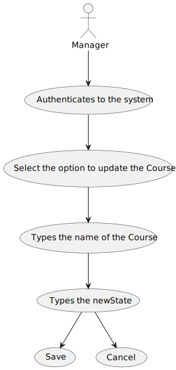
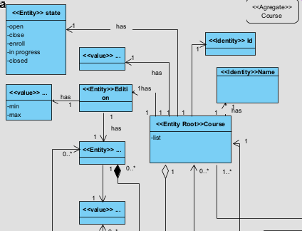
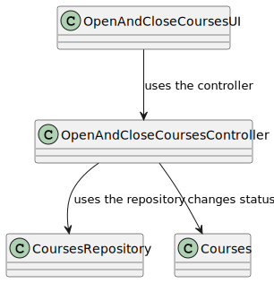
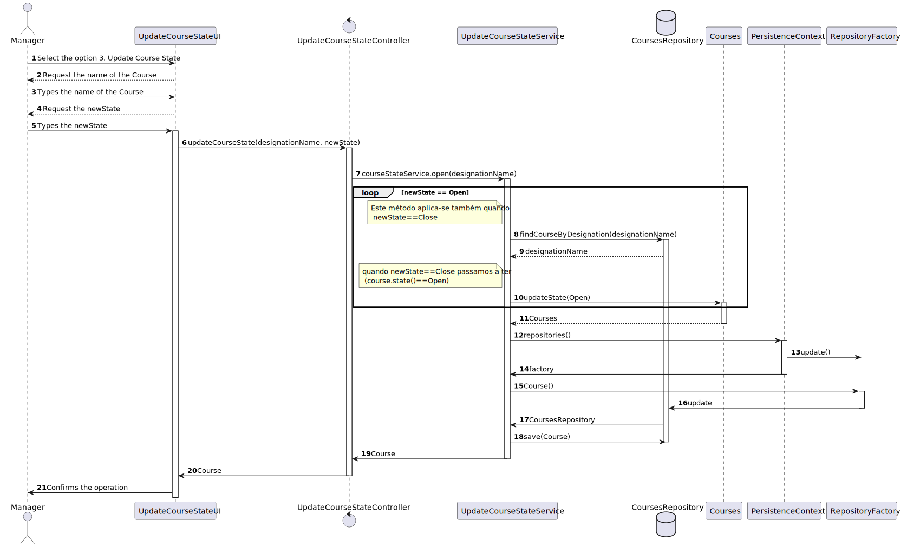

# US 1004 - As Manager, I want to open and close courses

*This is an example template*

## 1. Context

*The context for this task is the development of a new feature requested by the costumer. The purpose of this user story is to allow manager to open and close courses.*

## 2. Requirements

*The requirement is to develop the functionality for open and close courses. This user story is a new feature that has not been implemented before and depends on the implementation of US1002 As Manager, I want to create courses*

**US 1004** As Manager, I want to open and close courses
1. The Manager authenticates in the system.
2. The Manager accesses the functionality for update state of the courses.
3. The Manager choose the course he wants to update.
4. The system shows the new states available.
5. The Manager types the new state.
6. The system confirms the operation.


## 3. Analysis
In this section, the team should report the study/analysis/comparison that was done in order to take the best design decisions for the requirement. This section should also include supporting diagrams/artifacts (such as domain model; use case diagrams, etc.),

- At anytime, the manager may want to update the of the course.

- There have a dependency to US1002.

**Input Data:**

* Typed data:
    * Option to update the state of the course,
    * Desgination of the course
    * new state of the course


* Selected data:
    * Course,
    * State of the course

**Output Data:**

* State of the Course.

Below is the use case diagram to show the interactions between the manager and the system when open and close courses*




**Domain Model Excerpt**



## 4. Design

*In this sections, the team should present the solution design that was adopted to solve the requirement. This should include, at least, a diagram of the realization of the functionality (e.g., sequence diagram), a class diagram (presenting the classes that support the functionality), the identification and rational behind the applied design patterns and the specification of the main tests used to validade the functionality.*

### 4.1. Realization


| Interaction ID | Question: Which class is responsible for... | Answer                      | Justification (with patterns)                                                                                                |
|:---------------|:--------------------------------------------|:----------------------------|:-----------------------------------------------------------------------------------------------------------------------------|
| Step 1         | ... interacting with the actor?             | UpdateCourseStateUI         | UI pattern: UpdateCourseState is responsible for interacting with the actor to update the state of courses.                  |
|                | ... coordinating the US?                    | UpdateCourseStateController | Controller pattern: UpdateCourseStateController is responsible for coordinating the use case and invoking necessary classes. |
| Step 2         | ... Validate User                           | AppSettings                 | Settings pattern: AppSettings is responsible for validating if the user is valid based on application settings.              |
| Step 3         | .. return list of courses                   | CourseRepository            | Repository pattern: CourseRepository is responsible for retrieving the list of courses from the database.                    |
| Step 4         | .. show the course to the user              | ListCourseUI                | UI pattern: ListCourseUI is responsible for presenting the courses to the user.                                              |


### 4.2. Class Diagram



### 4.3 Sequence Diagran



### 4.4. Applied Patterns
    - Controller
    - Service
    - Persistence Context
    - Factory
    - Repository

### 4.5. Tests

**Test 1:** *Verifies that it is not possible to create an instance of the Example class with null values.*

```
@Test(expected = IllegalArgumentException.class)
public void ensureNullIsNotAllowed() {
	Example instance = new Example(null, null);
}
````

## 5. Implementation

*In this section the team should present, if necessary, some evidencies that the implementation is according to the design. It should also describe and explain other important artifacts necessary to fully understand the implementation like, for instance, configuration files.*

*It is also a best practice to include a listing (with a brief summary) of the major commits regarding this requirement.*

## 6. Integration/Demonstration

*In this section the team should describe the efforts realized in order to integrate this functionality with the other parts/components of the system*

*It is also important to explain any scripts or instructions required to execute an demonstrate this functionality*

## 7. Observations

*This section should be used to include any content that does not fit any of the previous sections.*

*The team should present here, for instance, a critical prespective on the developed work including the analysis of alternative solutioons or related works*

*The team should include in this section statements/references regarding third party works that were used in the development this work.*