# US 1006: As User, I want to list all the courses that are available to me

## 1. Context

All users can use this functionality.
Manager can see all courses
Student can see all open courses
Teacher can see all courses that it is enrolled;

## 2. Requirements

**US 1006** As {Ator} I want to list all the courses that are available to me

    FRC05 - List Courses All users are able to execute this functionality.

The user must be logged into the application and in the initial menu can list all existing courses.
This US depends on *US1002- Create Course*, only after courses are created it is possible to list them.

## 3. Analysis
**Input Data:**
* none

**Output Data:**

* List of all Courses

## Class Diagram Manager
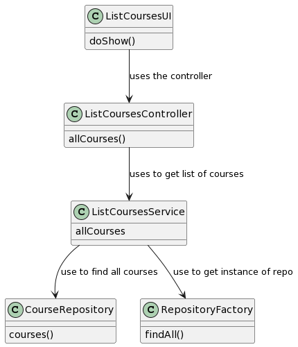
## Sequence Diagram Manager
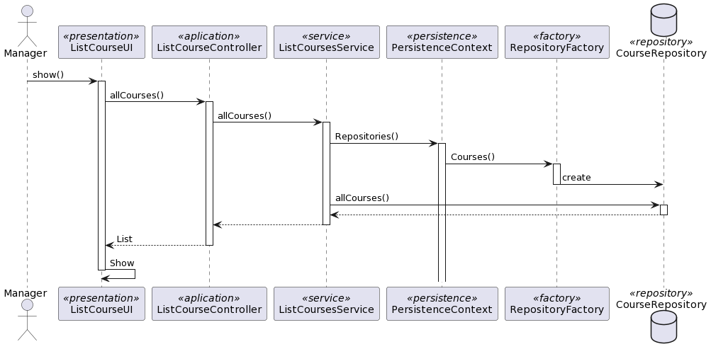
## System sequence diagram Manager
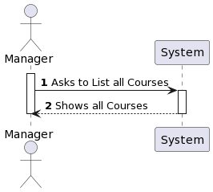
## Use case diagram Manager
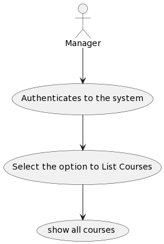

## Class Diagram Student
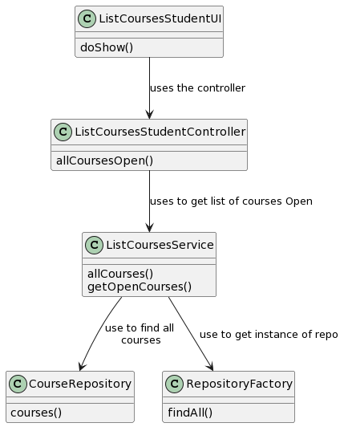
## Sequence Diagram Student
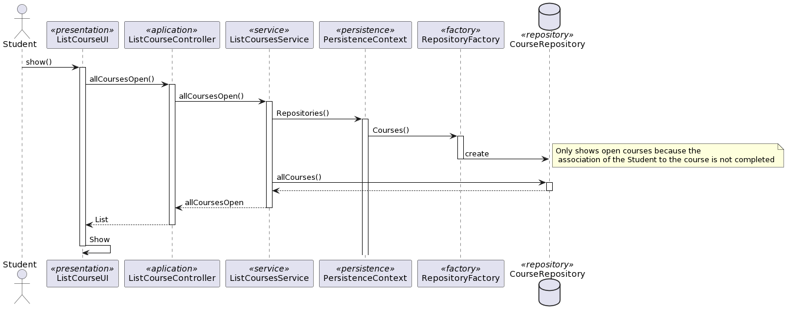
## System sequence diagram Student
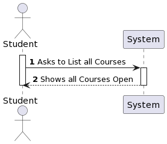
## Use case diagram Student

## Class Diagram Teacher
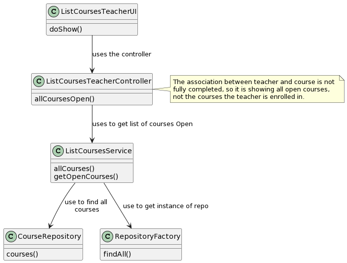
## Sequence Diagram Teacher
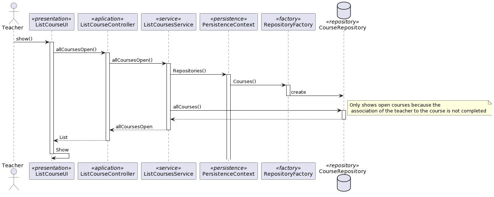
## System sequence diagram Teacher
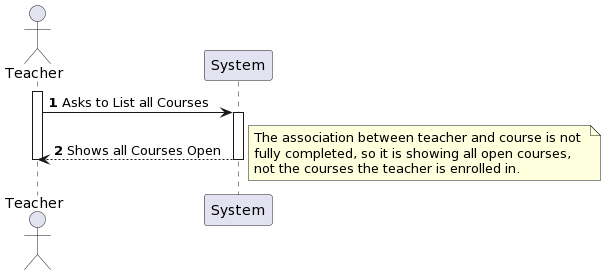
## Use case diagram Teacher
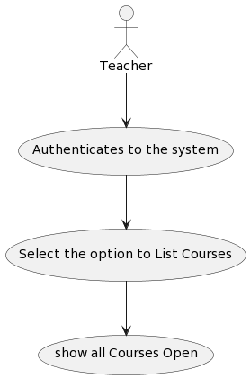
## 4. Design

| Interaction ID | Question: Which class is responsible for... | Answer               | Justification (with patterns)                                                                                         |
|:---------------|:--------------------------------------------|:---------------------|:----------------------------------------------------------------------------------------------------------------------|
| Step 1         | ... interacting with the actor?             | ListCourseUI         | UI pattern: ListCourseUI is responsible for interacting with the actor by presenting the list of courses.             |
|                | ... coordinating the US?                    | ListCourseController | Controller pattern: ListCourseController is responsible for coordinating the use case and invoking necessary classes. |
| Step 2         | ... Validate User                           | AppSettings          | Settings pattern: AppSettings is responsible for validating if the user is valid based on application settings.       |
| Step 3         | .. return list of courses                   | ListCoursesService   | Service pattern: Service is responsible for return list of courses depending of user                                  |
| Step 4         | .. show the course to the user              | ListCourseUI         | UI pattern: ListCourseUI is responsible for presenting the courses to the user.                                       |

### 4.1. Realization

### 4.3. Applied Patterns

In the implementation of this US the following DDD patterns were used:
- **Factory** : The "Repository factory" is responsible for creating instances of the "CourseRepository" repository.
- Service** : Using the "ListCoursesService" ensures that the correct courses are always returned.
- **Repository**: The "CourseRepository" is responsible for persisting/showing the data in the database.
- 
### 4.4. Tests
This is not a class of domain, dont have tests.

## 5. Implementation

*It is also a best practice to include a listing (with a brief summary) 
of the major commits regarding this requirement.*

## 6. Integration/Demonstration

## 7. Observations

*This US was not able to be completed in the best way because some US were not fully completed..*
*Especially the Teacher part is not completely complete.*