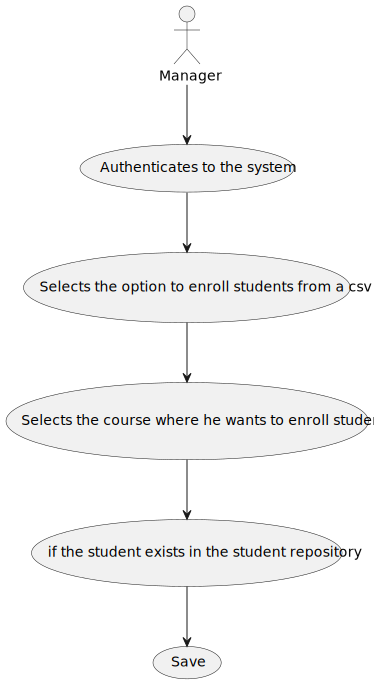

# US1007 - As Manager, I want to enroll students in bulk by importing their data using a csv file

*This is an example template*

## 1. Context

*The context for this task is the development of a new feature requested by the costumer. The purpose of this user story is to allow manager to enroll students in a course from a csv file .*

## 2. Requirements

- The requirement is to develop the functionality to enroll students from a csv file for managers.* 
- This user story is a new feature that has not been implemented and depends on the implementation of:
  - US1001 - As Manager, I want to be able to register, disable/enable, and list users of the system (Teachers and Students, as well as Managers).
  - US1002 - Create a Course.
  
**US1007** As Manager, I want to enroll students in bulk by importing their data using a csv file
1. The Manager authenticates in the system.
2. The Manager selects the option to enroll students from a csv .
3. The manager selects the course where he wants to enroll students.
4. The system reads the csv file.
5. The system verify if the student exists in the student repository .
6. For each student that exists in the repository, executes the student enrollment
7. The system confirms the operation.


## 3. Analysis

In this section, the team should report the study/analysis/comparison that was done in order to take the best design decisions for the requirement. This section should also include supporting diagrams/artifacts (such as domain model; use case diagrams, etc.),

- At anytime, the application user (authorized) may want to enroll students from a csv.

- There is a dependency to other US:
  - US1001 - As Manager, I want to be able to register, disable/enable, and list users of the system (Teachers and Students, as well as Managers)
  - US1002 - Create a Course

**Input Data:**

* Typed data:
    * N/A


* Selected data:
    * N/A

**Output Data:**

* Enrollment of a student in a course.

Below is the use case diagram to show the interactions between the manager and the system when enroll students from csv in a course.*




**Domain Model Excerpt**


* User Interface - This class is named CreateSharedBoardUI where it will include a form to create a shared board. The form will include fields for the board name and users to add to the board.
* Controller     - This class is named CreateSharedBoardController where will be responsible for managing UI requests and performing the necessary actions to create the shared board.
* Repository     - This class is named SharedBoardRepository where it will store the data about the shared boards


## 4. Design

*In this sections, the team should present the solution design that was adopted to solve the requirement. This should include, at least, a diagram of the realization of the functionality (e.g., sequence diagram), a class diagram (presenting the classes that support the functionality), the identification and rational behind the applied design patterns and the specification of the main tests used to validade the functionality.*

### 4.1. Realization


| Interaction ID | Question: Which class is responsible for...      | Answer                      | Justification (with patterns)                                                                                                |
|:---------------|:-------------------------------------------------|:----------------------------|:-----------------------------------------------------------------------------------------------------------------------------|
| Step 1         | ... interacting with the actor?                  | CreateSharedBoarUI          | UI pattern: CreateSharedBoardUI is responsible for interacting with the actor to create a shared board.                      |
|                | ... coordinating the US?                         | CreateSharedBoardController | Controller pattern: CreateSharedBoardController is responsible for coordinating the use case and invoking necessary classes. |
| Step 2         | ... Create Shared Board                          | SharedBoardBuilder          | Creates a complex object on a valid state                                                                                    |
| Step 3         | ... Save the Shared Board                        | Persistence Context         |                                                                                                                              |
| Step 4         | .. show the Shared Board information to the user | CreateSharedBoardUI         |                                                                                                                 |


### 4.2. Class Diagram


### 4.3 Sequence Diagran


### 4.4. Applied Patterns
  - Controller
  - Builder
  - Persistence Context
  - Repository

### 4.5. Tests

**Test 1:** *Verifies that it is not possible to create an instance of the SharedBoard class with the same title.*

```
 @Test
    public void testIfSharedBoardIsEqualsToAnotherSharedBoard(){
        assertTrue(board1.sameAs(board1));
        assertFalse(board1.sameAs(board2));
    }
````


## 5. Implementation

*In this section the team should present, if necessary, some evidencies that the implementation is according to the design. It should also describe and explain other important artifacts necessary to fully understand the implementation like, for instance, configuration files.*

*It is also a best practice to include a listing (with a brief summary) of the major commits regarding this requirement.*

## 6. Integration/Demonstration

*In this section the team should describe the efforts realized in order to integrate this functionality with the other parts/components of the system*

*It is also important to explain any scripts or instructions required to execute an demonstrate this functionality*

## 7. Observations

*This section should be used to include any content that does not fit any of the previous sections.*

*The team should present here, for instance, a critical prespective on the developed work including the analysis of alternative solutioons or related works*

*The team should include in this section statements/references regarding third party works that were used in the development this work.*