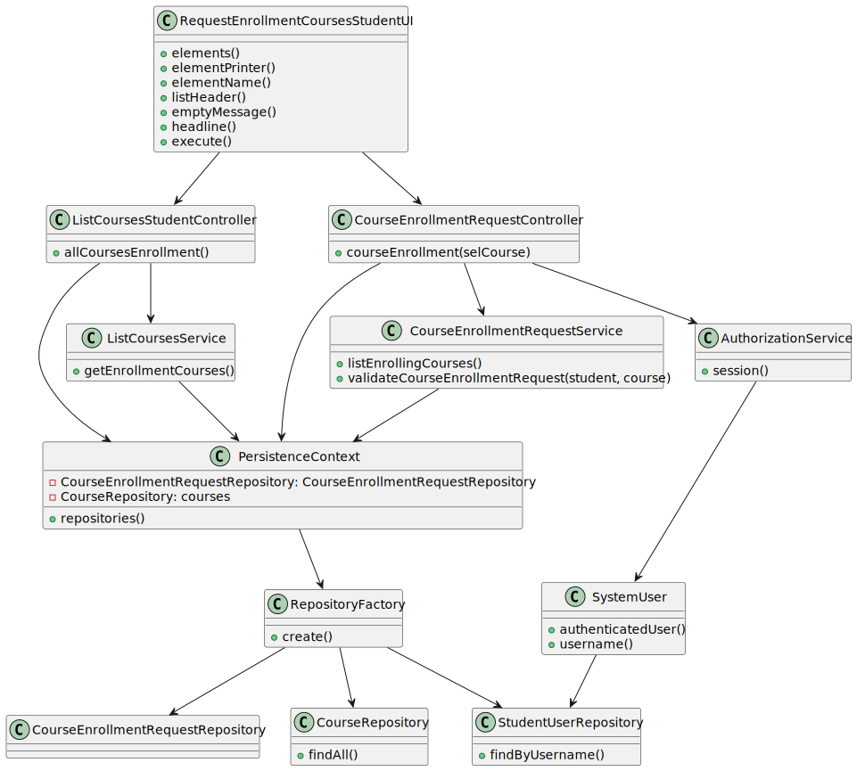

# US1008 - As Student, I want to request my enrollment in a course

## 1. Requirements Engineering

### 1.1. User Story Description

The student requests to be enrolled in a course

### 1.2. Customer Specifications and Clarifications 

**From the specifications document:**
* The student requests to be enrolled in a course 
* Courses may have a minimum and a maximum number of enrolled students. 
* This may limit the possibility of opening (i.e. starting) courses that do not satisfy the limits.

**From the client clarifications:**

> **Question**
>
>  **Answer**
 
### 1.3. Acceptance Criteria

* **FRC07:** Request Enrollment in Course The student requests to be enrolled in a course

The user needs to be logged in the application as a Student.

### 1.4. Found out Dependencies

* There is a dependency to "US1001 - As Manager, I want to be able to register, disable/enable, and list users of the system (Teachers and Students, as well as Managers)
* There is a dependency to "US1002 - As Manager, I want to create courses
* There is a dependency to "US1003" - As Manager, I want to open and close enrollements in courses

### 1.5 Input and Output Data

**Input Data:**
-/

**Output Data:**

* Course Enrollment

### Analysis

* User Interface - This class is named CreateCourseEnrollmentRequestUI where it will allow the Student to create a course enrollment request.
* Controller     - This class is named CourseEnrollmentRequestController where will be responsible for managing UI requests and performing the necessary actions to create the course enrollment Request.
* Repository     - This class is named CourseEnrollmentRequestRepository where it will store the data about the course enrollment Request
* Service        - listEnrollingCoursesService that list all the course that have the enroll state

*Below is the use case diagram to show the interactions between the manager and the system 

### 1.6. System Sequence Diagram (SSD)

### 1.7 Other Relevant Remarks

## 3. Design - User Story Realization 

### 3.1. Rationale

**SSD - Alternative 1 is adopted.**

| Interaction ID | Question: Which class is responsible for...  | Answer                            | Justification (with patterns)                                                                                                      |
|:---------------|:---------------------------------------------|:----------------------------------|:-----------------------------------------------------------------------------------------------------------------------------------|
| Step 1         | ... interacting with the actor?              | CreateCourseEnrollmentRequestUI   | UI pattern: CreateCourseEnrollmentRequestUI is responsible for interacting with the actor                                          |
|                | ... coordinating the US?                     | CourseEnrollmentRequestController | Controller pattern: CourseEnrollmentRequestController is responsible for coordinating the use case and invoking necessary classes. |
| Step 15        | ... saving the course enrollment information | CourseEnrollmentRepository        | Repository pattern: CourseEnrollmentRepository is responsible for saving the course enrollment data in the database.               |
| Step 2         | ... lists the courses with enroll state      | ListEnrollingCoursesService       | Service: ListEnrollingCoursesService is responsible for listing all the courses with enroll state                                  |

### Systematization ##

According to the taken rationale, the conceptual classes promoted to software classes are: 

 * CourseEnrollment

Other software classes (i.e. Pure Fabrication) identified: 

 * CourseEnrollmentRequestController
 * ListEnrollingCoursesService
 * CourseEnrollmentRepository

## 3.2. Sequence Diagram (SD)

## 3.3. Class Diagram (CD)

# 4. Tests

# 5. Construction (Implementation)
-/

# 6. Integration and Demo 
/-

# 7. Observations
/-

