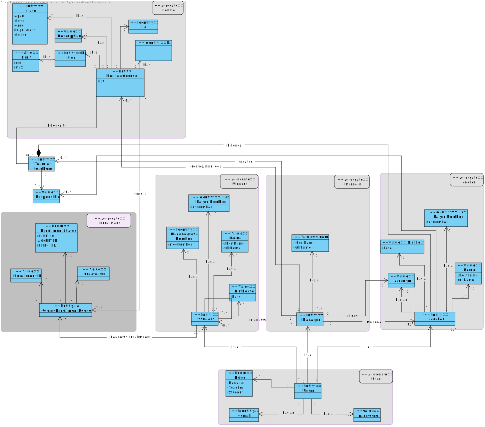
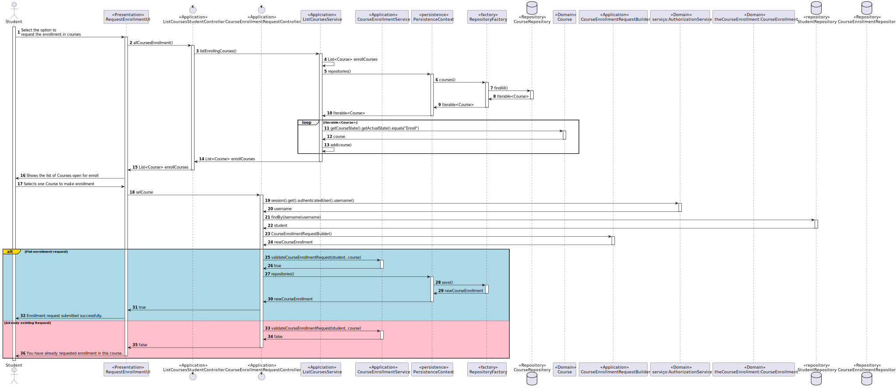

# US1008 - As Student, I want to request my enrollment in a course

## 1. Requirements Engineering

### 1.1. User Story Description

The student requests to be enrolled in a course

### 1.2. Customer Specifications and Clarifications 

**From the specifications document:**
* The student requests to be enrolled in a course 
* Courses may have a minimum and a maximum number of enrolled students. 
* This may limit the possibility of opening (i.e. starting) courses that do not satisfy the limits.

**From the client clarifications:**

> **Question**
>
>  **Answer**
 
### 1.3. Acceptance Criteria

* **FRC07:** Request Enrollment in Course The student requests to be enrolled in a course

The user needs to be logged in the application as a Student.

### 1.4. Found out Dependencies

* There is a dependency to "US1001 - As Manager, I want to be able to register, disable/enable, and list users of the system (Teachers and Students, as well as Managers)
* There is a dependency to "US1002 - As Manager, I want to create courses
* There is a dependency to "US1003" - As Manager, I want to open and close enrollements in courses

### 1.5 Input and Output Data

**Input Data:**
-/

**Output Data:**

* Course Enrollment

### Analysis

* User Interface - This class is named CreateCourseEnrollmentRequestUI where it will allow the Student to create a course enrollment request.
* Controller     - This class is named CourseEnrollmentRequestController where will be responsible for managing UI requests and performing the necessary actions to create the course enrollment Request.
* Repository     - This class is named CourseEnrollmentRequestRepository where it will store the data about the course enrollment Request
* Service        - listEnrollingCoursesService that list all the course that have the enroll state

*Below is the use case diagram to show the interactions between the manager and the system 

### 1.6. Domain Model

### 1.7. System Sequence Diagram (SSD)

### 1.8. Other Relevant Remarks

## 3. Design - User Story Realization 

### 3.1. Rationale

**SSD - Alternative 1 is adopted.**

| Interaction ID | Question: Which class is responsible for...  | Answer                            | Justification (with patterns)                                                                                                      |
|:---------------|:---------------------------------------------|:----------------------------------|:-----------------------------------------------------------------------------------------------------------------------------------|
| Step 1         | ... interacting with the actor?              | RequestEnrollmentUI               | UI pattern: RequestEnrollmentUI is responsible for interacting with the actor                                          |
|                | ... coordinating the US?                     | CourseEnrollmentRequestController | Controller pattern: CourseEnrollmentRequestController is responsible for coordinating the use case and invoking necessary classes. |
| Step 15        | ... saving the course enrollment information | CourseEnrollmentRepository        | Repository pattern: CourseEnrollmentRepository is responsible for saving the course enrollment data in the database.               |
| Step 2         | ... lists the courses with enroll state      | ListEnrollingCoursesService       | Service: ListEnrollingCoursesService is responsible for listing all the courses with enroll state                                  |

### Systematization ##

According to the taken rationale, the conceptual classes promoted to software classes are: 

 * CourseEnrollment

Other software classes (i.e. Pure Fabrication) identified: 

 * CourseEnrollmentRequestController
 * ListEnrollingCoursesService
 * CourseEnrollmentRepository

## 3.2. Sequence Diagram (SD)

## 3.3. Class Diagram (CD)

# 4. Tests

    class CourseEnrollmentRequestTest {
        private CourseEnrollmentRequest courseEnrollmentRequest1;
        private CourseEnrollmentRequest courseEnrollmentRequest2;
        private CourseEnrollmentRequest courseEnrollmentRequest3;
        private Course course1;
        private Course course2;
        private Role STUDENT;
        private Set<Role> roles1 = new HashSet<>();
        private Set<Role> roles2 = new HashSet<>();
        private SystemUser student;
        private Student student1;
        private Student student2;
        private Role TEACHER;
        private SystemUser teacher;
    
        @BeforeEach
        public void setUp() throws ParseException {
            STUDENT = Role.valueOf("STUDENT");
            TEACHER = Role.valueOf("TEACHER");
            roles1.add(STUDENT);
            roles2.add(TEACHER);
            SystemUser student = new SystemUserBuilder(new NilPasswordPolicy(), new PlainTextEncoder()).with("Mig", "teste", "Miguel", "Seixas", "miguel@isep.pt").withRoles(roles1).build();
            SystemUser teacher = new SystemUserBuilder(new NilPasswordPolicy(), new PlainTextEncoder()).with("Mar", "teste", "Mariana", "Seixas", "mariana@isep.pt").withRoles(roles2).build();
            student1 = new StudentBuilder().build(student, "1100358");
            student2 = new StudentBuilder().build(student, "1100529");
            course1 = new CourseBuilder().descriptioned(Description.valueOf("Course for developers"))
                    .named(Designation.valueOf("ESOFT")).edition(CourseEdition.valueOf("2022/2023")).teacherCoordinator(teacher).build();
            course2 = new CourseBuilder().descriptioned(Description.valueOf("Course for developers"))
                    .named(Designation.valueOf("EAPLI")).edition(CourseEdition.valueOf("2022/2023")).teacherCoordinator(teacher).build();
    
            courseEnrollmentRequest1 = new CourseEnrollmentRequestBuilder().theCourse(course1).theStudent(student1).build();
            courseEnrollmentRequest2 = new CourseEnrollmentRequestBuilder().theCourse(course2).theStudent(student2).build();
            courseEnrollmentRequest3 = new CourseEnrollmentRequestBuilder().theCourse(course1).theStudent(student1).build();
    
        }
    
        @Test
        public void testIfCourseEnrollmentRequestCourseIsRequired() {
            assertThrows(IllegalStateException.class, () -> {
                Course nullCourse = null;
                new CourseEnrollmentRequestBuilder().theCourse(nullCourse).theStudent(student1).build();
            });
        }
    
        @Test
        public void testIfCourseEnrollmentRequestStudentIsRequired() {
            assertThrows(IllegalStateException.class, () -> {
                Student nullStudent = null;
                new CourseEnrollmentRequestBuilder().theCourse(course1).theStudent(nullStudent).build();
            });
        }
    
        @Test
        public void testIfAllParametersAreFilled() {
            assertDoesNotThrow(() -> {
                new CourseEnrollmentRequestBuilder().theCourse(course1).theStudent(student1).build();
    
                assertEquals(course1, courseEnrollmentRequest1.courseEnrollmentRequestCourse());
                assertEquals(student1, courseEnrollmentRequest1.courseEnrollmentRequestStudent());
            });
        }
    
        @Test
        public void testIfCourseEnrollmenteCourseIsCorrect() {
            assertEquals(course1, courseEnrollmentRequest1.courseEnrollmentRequestCourse());
            assertEquals(course2, courseEnrollmentRequest2.courseEnrollmentRequestCourse());
            assertNotEquals(course2, courseEnrollmentRequest1.courseEnrollmentRequestCourse());
        }
    
        @Test
        public void testIfCourseEnrollmenteStudentIsCorrect() {
            assertEquals(student1, courseEnrollmentRequest1.courseEnrollmentRequestStudent());
            assertEquals(student2, courseEnrollmentRequest2.courseEnrollmentRequestStudent());
            assertNotEquals(student2, courseEnrollmentRequest1.courseEnrollmentRequestStudent());
        }
    
        @Test
        public void testCourseEnrollmentRequest() {
            new CourseEnrollmentRequestBuilder().theCourse(course1).theStudent(student1).build();
    
            assertEquals(course1, courseEnrollmentRequest1.courseEnrollmentRequestCourse());
            assertEquals(student1, courseEnrollmentRequest1.courseEnrollmentRequestStudent());
        }
    
        @Test
        public void testEqualsCourseEnrollmentRequest() {
    
            assertTrue(courseEnrollmentRequest1.sameAs(courseEnrollmentRequest3));
        }
    
        @Test
        public void testNotEqualsRecurringLessons() {
    
            assertFalse(courseEnrollmentRequest1.sameAs(courseEnrollmentRequest2));
        }
    
    }

# 5. Construction (Implementation)

### CourseEnrollmentRequest

    public class CourseEnrollmentRequest implements AggregateRoot<Long> {
    
        @Id
        @GeneratedValue(strategy = GenerationType.AUTO)
        private Long EnrollmentID;
    
        @ManyToOne
        @JoinColumn(name = "course_id")
        private Course course;
    
        @ManyToOne
        @JoinColumn(name = "student_id")
        private Student student;
    
        /*
        @OneToMany
        @JoinColumn(name = "courseEnrollmentRequest")
        private List<ListEnrollmentRequests> enrollmentRequestsList;
    
    
         */
    
        @Enumerated(EnumType.STRING)
        @Column(nullable = false)
        private EnrollmentStatus enrollmentStatus;
    
        @Column
        //date on format dd/mm/yyyy hh:mm
        private Calendar createdOn;
    
        public CourseEnrollmentRequest(Course course, Student student) {//List<CourseEnrollmentRequest> listOfCourseRequests){
            Preconditions.noneNull(course, student);
            this.course = course;
            this.student = student;
            this.enrollmentStatus = EnrollmentStatus.PENDING;
            this.createdOn = CurrentTimeCalendars.now();
    
            //this.enrollmentRequestsList = new ArrayList<>();
            //this.enrollmentRequestsList.add(new ListEnrollmentRequests(this, course, student));
    
        }
    
        public CourseEnrollmentRequest() {
        }
    
        //public List<ListEnrollmentRequests> enrollmentRequests(){return this.enrollmentRequestsList;}
    
    
        @Override
        public boolean sameAs(Object other) {
            if (this == other) {
                return true;
            }
    
            if (!(other instanceof CourseEnrollmentRequest)) {
                return false;
            }
    
            final CourseEnrollmentRequest otherCourseEnrollmentRequest = (CourseEnrollmentRequest) other;
    
            return course.equals(otherCourseEnrollmentRequest.course)
                    && student.equals(otherCourseEnrollmentRequest.student)
                    && enrollmentStatus.equals(otherCourseEnrollmentRequest.enrollmentStatus)
                    && createdOn.equals(otherCourseEnrollmentRequest.createdOn);
        }
    
        @Override
        public boolean equals(final Object o) {
            return DomainEntities.areEqual(this, o);
        }
    
        @Override
        public Long identity() {
            return EnrollmentID;
        }
    
        public Course courseEnrollmentRequestCourse() { return course; }
    
        public Student courseEnrollmentRequestStudent() { return student; }
    
        public EnrollmentStatus courseEnrollmentStatus() {return enrollmentStatus;}
    
        public void approveEnrollment(Student student) {
            this.enrollmentStatus = EnrollmentStatus.ACCEPTED;
            course.studentsEnrolled(student);
        }
    
        public void rejectEnrollment(Student student) {
            this.enrollmentStatus = EnrollmentStatus.REJECTED;
        }
    }

### EnrollmentStatus

    public enum EnrollmentStatus {
        PENDING, ACCEPTED, REJECTED
    }

### CourseEnrollmentRequestBuilder

    public class CourseEnrollmentRequestBuilder implements DomainFactory<CourseEnrollmentRequest> {
    
        private CourseEnrollmentRequest theCourseEnrollmentRequest;
    
        private Long theEnrollmentID;
    
        private Course theCourse;
    
        private Student theStudent;
    
        //private List<CourseEnrollmentRequest> theEnrollmentRequestsList;
    
    
    
        private EnrollmentStatus theEnrollmentStatus;
    
        private Calendar theCreatedOn;
    
        public CourseEnrollmentRequestBuilder theCourse(final Course course) {
            this.theCourse = course;
            return this;
        }
    
        public CourseEnrollmentRequestBuilder theStudent(final Student student) {
            this.theStudent = student;
            return this;
        }
    
        /*
        public CourseEnrollmentRequestBuilder theEnrollmentRequestList(final List<CourseEnrollmentRequest> enrollmentRequestsList) {
            this.theEnrollmentRequestsList = enrollmentRequestsList;
            return this;
        }
    
         */
    
        public CourseEnrollmentRequestBuilder theEnrollmentStatus(final EnrollmentStatus enrollmentStatus) {
            this.theEnrollmentStatus = enrollmentStatus;
            return this;
        }
    
        private CourseEnrollmentRequest buildOrThrow() {
            // we will create the actual instance inside the builder during the building
            // process, but that is hidden from the client code. conceptually, the client
            // code only sees the new instance (it is only built) in the build method
            if (theCourseEnrollmentRequest != null) {
                return theCourseEnrollmentRequest;
            }
    
            if (theCourse != null && theStudent != null) {
                theCourseEnrollmentRequest = new CourseEnrollmentRequest(theCourse, theStudent);
                return theCourseEnrollmentRequest;
            }
            throw new IllegalStateException();
        }
    
        @Override
        public CourseEnrollmentRequest build() {
            final var ret = buildOrThrow();
            // make sure we will create a new instance if someone reuses this builder and do
            // not change the previously built course.
            theCourseEnrollmentRequest = null;
            return ret;
        }
    }

### CourseEnrollmentRequestRepository

    public interface CourseEnrollmentRequestRepository extends DomainRepository<Long, CourseEnrollmentRequest> {
    
        Iterable<CourseEnrollmentRequest> pendingCourseEnrollmentRequests();
    
        CourseEnrollmentRequest findByStudentAndCourse(Student student, Course course);
    
    }

### CourseEnrollmentRequestController

    public class CourseEnrollmentRequestController {
    
        StudentUserRepository studentRepository = PersistenceContext.repositories().studentUsers();
    
        CourseEnrollmentRequestService service = new CourseEnrollmentRequestService();
    
        private static final AuthorizationService authz = AuthzRegistry.authorizationService();
    
        @Transactional
        public boolean courseEnrollment(Course course) {
    
            Username username = authz.session().get().authenticatedUser().username();
    
            //Student student = studentRepository.findByUsername(username);
    
            Student student = authz.session()
                    .map(UserSession::authenticatedUser)
                    .flatMap(systemUser -> studentRepository.findByUsername(username))
                    .orElse(null);
    
            final var newCourseEnrollment = new CourseEnrollmentRequestBuilder().theCourse(course).theStudent(student).build();
    
            if(service.validateCourseEnrollmentRequest(student, course)) {
                PersistenceContext.repositories().courseEnrollmentRequests().save(newCourseEnrollment);
                return true;
            } else {
                return false;
            }
    
        }
    
    }

# 6. Integration and Demo 
/-

# 7. Observations
/-

