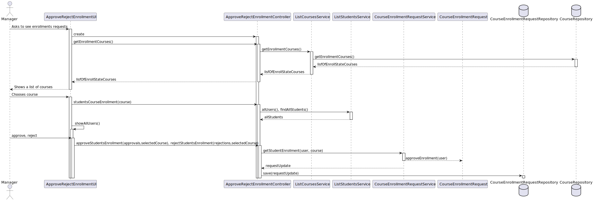
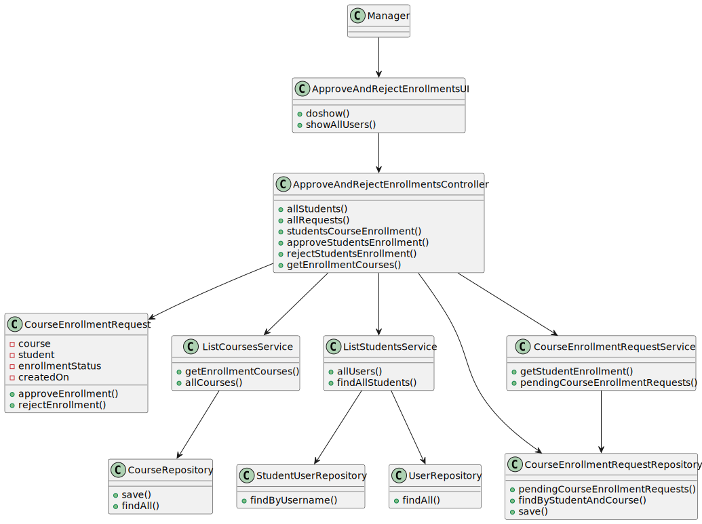

# US 1009 - As Manager, I want to approve or reject students applications to courses

*This is an example template*

## 1. Context

*Explain the context for this task. It is the first time the task is assigned to be developed or this tasks was incomplete in a previous sprint and is to be completed in this sprint? Are we fixing some bug?*

This US allows a manager to approve or reject students application in a course. 
The manager has access to all courses and respective enrollments requests.

## 2. Requirements

*In this section you should present the functionality that is being developed, how do you understand it, as well as possible correlations to other requirements (i.e., dependencies).*

**US1009** As Manager, I want to approve or reject students applications to courses

- Approve/Reject Enlistment in Course A manager approves or rejects a students’ application to a course.

## 3. Analysis

*In this section, the team should report the study/analysis/comparison that was done in order to take the best design decisions for the requirement. This section should also include supporting diagrams/artifacts (such as domain model; use case diagrams, etc.),*

- At anytime, the manager wants to approve or reject a students application in a course.
For that matter, a repository for courseEnrollmentRequestRepository must be created in other to assure the business domain and an abstraction 
layer between the domain code and the data storage.

- There is a dependency to the US008 - As Student, I want to request my enrollment in a course.
- There is a dependency to the US1002 - As Manager, I want to create courses.

**Input Data:**

* Selected data:
    * course
    * student

**Output Data:**

* an approved or rejected a student application.


**Domain Model Excerpt**


## 4. Design

*In this sections, the team should present the solution design that was adopted to solve the requirement. This should include, at least, a diagram of the realization of the functionality (e.g., sequence diagram), a class diagram (presenting the classes that support the functionality), the identification and rational behind the applied design patterns and the specification of the main tests used to validade the functionality.*


### 4.1. Realization


**System Sequence Diagram (SSD)**


**Rationale**

| Interaction ID                            | Question: Which class is responsible for... | Answer                            | Justification (with patterns)                                                                                   |
|:------------------------------------------|:--------------------------------------------|:----------------------------------|:----------------------------------------------------------------------------------------------------------------|
| Step 1 - Asks to see enrollments requests | ... interacting with the actor?             | ApproveRejectEnrollmentUI         | Pure Fabrication: there is no reason to assign this responsibility to any existing class in the Domain Model.   |
|                                           | ... coordinating the US?                    | ApproveRejectEnrollmentController | Controller                                                                                                      |
| Step 2 - Asks to choose a course          | ... having the requested information?       | CourseRepository                  | Abstracts data access by providing an abstraction layer between the domain code and the data storage mechanism. |
| Step 4 - Shows students requests          | ... having the requested information?       | CourseEnrollmentRequestRepository | Abstracts data access by providing an abstraction layer between the domain code and the data storage mechanism. |
|                                           | ... updating the enrollment request?        | CourseEnrollmentRequest           | Creator (Rule 1).                                                                                               |
| Step 6 - Saves enrollment                 | ... saving the enrollment request?          | PersistenceContext                | Allows the management of entity instances, and is responsible for tracking changes made on those entities.      |

**Sequence Diagram (SD)**



*Note* Builders, factories, Persistence Context and other DDD domains weren't represented to lower the SD's complexity.

### 4.2. Class Diagram



### 4.3. Applied Patterns
    - Controller
    - Builder
    - Persistence Context
    - Repository Factory
    - Service
    - Repository
    
### 4.4. Tests

**Test 1:** * Verifies that it is not possible to approve or reject an enrollment without a course.
**Test 2:** * Verifies that it is not possible to approve or reject an enrollment without a student application.

```
    
   
````

## 5. Implementation

*In this section the team should present, if necessary, some evidencies that the implementation is according to the design. It should also describe and explain other important artifacts necessary to fully understand the implementation like, for instance, configuration files.*

*It is also a best practice to include a listing (with a brief summary) of the major commits regarding this requirement.*

N/A

## 6. Integration/Demonstration

*In this section the team should describe the efforts realized in order to integrate this functionality with the other parts/components of the system*

*It is also important to explain any scripts or instructions required to execute an demonstrate this functionality*

N/A

## 7. Observations

*This section should be used to include any content that does not fit any of the previous sections.*

*The team should present here, for instance, a critical prespective on the developed work including the analysis of alternative solutioons or related works*

*The team should include in this section statements/references regarding third party works that were used in the development this work.*

N/A