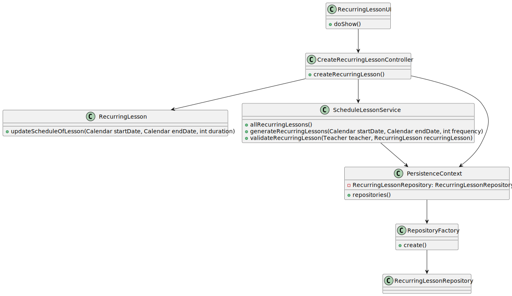

# US1010 - As Teacher, I want to schedule a class

## 1. Requirements Engineering

### 1.1. User Story Description

A teacher schedule a class (always a recurring class, happens every week). System must check if the Teacher is available for the class period.

### 1.2. Customer Specifications and Clarifications 

**From the specifications document:**
* Teachers are responsible for scheduling classes for their courses. 
* A class is always a recurring weekly event.
* A class must have a unique title, a date and a duration. 
* It should be impossible to schedule classes that are coincident with other classes of the same course. 
* The system should also warn if one of the participants in the class (either a teacher or a student) has other classes at the same time. [...]

**From the client clarifications:**

> **Question**
> 
> Bom dia!
> Nestas duas US, pretende que seja mostrada a lista de Class/ExtraClass que já estão agendadas para que o professor saiba onde pode agendar?

>  **Answer**
> 
> Boa tarde.
> Em termos de requisitos é importante que o sistema garanta as regras que estão descritas em 5.1.2 relativo a aulas e aulas extra. Em termos de user interface para cada um desses casos de uso não existem requisitos específicos.
> Nesse aspeto de "user experience" devem seguir boas práticas. Mas isso já faz parte do desenho da solução. "O cliente não percebe muito disso :-)"
>

> **Question**
>
> Good afternoon, I've a question regarding the shedule of a class. A teacher can only schedule classes to a given course that he/her is in?
 
>  **Answer**
> 
> Bom dia.
> Por favor siga o processo que indiquei em https://moodle.isep.ipp.pt/mod/forum/discuss.php?d=22571#p28540 antes de colocar a questão.

> **Question:**
>
> Good afternoon, I've a question regarding the shedule of a class and of an extra class.
> Is it possible (or there should be a warning) to schedule a class and/or an extra class when a student and/or teacher, that will be part of it, have a meeting at the same time that the class will happen? 

> **Answer:**
>
> Bom dia.
> Por favor siga o processo que indiquei em https://moodle.isep.ipp.pt/mod/forum/discuss.php?d=22571#p28540 antes de colocar a questão.

> **Question:** 

> Dear Client,
> The teacher that schedules the class is the one that will give it, or can one teacher schedule a class that will be assigned to another teacher?
> Best regards,

> **Answer:** 
>
>Bom dia.
>Por favor siga o processo que indiquei em https://moodle.isep.ipp.pt/mod/forum/discuss.php?d=22571#p28540 antes de colocar a questão.

### 1.3. Acceptance Criteria

* **FRC09:** Schedule of Class A teacher schedule a class (always a recurring class, happens every week). System must check if the Teacher is available for the class period

The user needs to be logged in the application as a teacher.

### 1.4. Found out Dependencies

* There is a dependency to "US1001 - As Manager, I want to be able to register, disable/enable, and list users of the system (Teachers and Students, as well as Managers)
* There is a dependency to "US01002 - As Manager, I want to create courses
* There is a dependency to "US1005 - As Manager, I want to set the teachers of a course

### 1.5 Input and Output Data

**Input Data:**

* Typed data:
	* Title
    * Start Date
    * End Date
    * Start Time
    * Duration
    * Frequency

**Output Data:**

* Recurring Lesson

### Analysis

* User Interface - This class is named CreateRecurringLessonUI where it will allow the teacher to create a recurring lesson.
* Controller     - This class is named RecurringLessonController where will be responsible for managing UI requests and performing the necessary actions to create the recurring lesson.
* Repository     - This class is named RecurringLessonRepository where it will store the data about the Recurring Lessons
* Service        - ScheduleLessonService that propagates the recurring lesson with a certain frequency and validates that the teacher doesnt have a lesson in that date/time

*Below is the use case diagram to show the interactions between the manager and the system when open and close courses*

### 1.6. System Sequence Diagram (SSD)

### 1.7 Other Relevant Remarks

## 3. Design - User Story Realization 

### 3.1. Rationale

**SSD - Alternative 1 is adopted.**

| Interaction ID | Question: Which class is responsible for... | Answer                    | Justification (with patterns)                                                                                                                        |
|:---------------|:--------------------------------------------|:--------------------------|:-----------------------------------------------------------------------------------------------------------------------------------------------------|
| Step 1         | ... interacting with the actor?             | CreateRecurringLessonUI   | UI pattern: CreateRecurringLessonUI is responsible for interacting with the actor                     |
|                | ... coordinating the US?                    | RecurringLessonController | Controller pattern: RecurringLessonController is responsible for coordinating the use case and invoking necessary classes.                           |
| Step 2         | .. return list of courses                   | RecurringLessonRepository | Repository pattern: RecurringLessonRepository is responsible for saving the recurring lesson in the database.                                        |
| Step 3         | .. propagates the lesson and validates      | ScheduleLessonService     | Service: ScheduleRecurringLesson is responsible propagating the lesson for a certain frequency and validates the teacher availability for the lesson |

### Systematization ##

According to the taken rationale, the conceptual classes promoted to software classes are: 

 * RecurringLesson

Other software classes (i.e. Pure Fabrication) identified: 

 * CreateRecurringLessonController
 * ScheduleLessonService
 * RecurringLessonRepository

## 3.2. Sequence Diagram (SD)

## 3.3. Class Diagram (CD)

# 4. Tests

# 5. Construction (Implementation)

## Class Company

    @XmlRootElement
    @Entity
    public class RecurringLesson implements AggregateRoot<Designation>, Representationable {
    /**
    * The primary key of lesson is the unique title
    */
    @XmlElement
    @JsonProperty
    @EmbeddedId
    private Designation title;

    @Temporal(TemporalType.DATE)
    @Column(nullable = false)
    private Calendar startDate;

    @Temporal(TemporalType.DATE)
    @Column(nullable = false)
    private Calendar endDate;

    @Column(nullable = false)
    private int duration;

    protected RecurringLesson(Designation title, Calendar startDate, Calendar endDate, int duration) {
        this.title = title;
        this.startDate = startDate;
        this.endDate = endDate;
        this.duration = duration;
    }

    protected RecurringLesson() {
    }

    @Override
    public boolean equals(final Object o) {
        return DomainEntities.areEqual(this, o);
    }

    @Override
    public int hashCode() {
        return DomainEntities.hashCode(this);
    }

    @Override
    public boolean sameAs(final Object other) {
        if (!(other instanceof RecurringLesson)) {
            return false;
        }

        final RecurringLesson that = (RecurringLesson) other;
        if (this == that) {
            return true;
        }
        return identity().equals(that.identity()) && startDate.equals(that.startDate) && endDate.equals(that.endDate) && duration == that.duration;
    }

    @Override
    public <R> R buildRepresentation(final RepresentationBuilder<R> builder) {
        return null;
    }

    @Override
    public Designation identity() { return this.title; }

    public Designation title() { return this.title;}

    public Calendar startDate() { return this.startDate;}

    public Calendar endDate() { return this.endDate;}

    public int duration() { return this.duration;}

    public RecurringLesson updateScheduleOfLesson(Calendar startDate, Calendar endDate, int duration){
        this.duration = duration;
        this.startDate = startDate;
        this.endDate = endDate;
        return this;
      }
    }

# 6. Integration and Demo 
/-

# 7. Observations
/-

