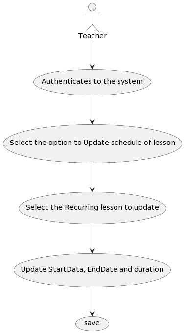

# US 1012 - As Teacher, I want to update the schedule of a class

## 1. Context

The Teacher wants to be able to edit the time and date of the Recurringlessons, so we will give the option in the Teacher's application to change the start date, end date and duration of the lessons already created.

## 2. Requirements

*Example*

**US 1012** As Teacher, I want to update the schedule of a class

- FRC11 - Update Schedule of Class: A teacher changes the time of a specific class (only changes a specific occurrence of a recurring class).

*This US depends directly on * US1010 As Teacher, I want to scheduler a class * and cannot be implemented without first finalizing this US.*

## 3. Analysis

**input Data:**
* Typed Data:
    * StartDate
    * EndDate
    * Duration

**Output Data:**
* Recuring Lesson is update and save

## 4. Design

## Class diagram

## Use case diagram

## Sequence diagram

## System sequence diagram

*Rational*

| Interaction ID | Question: Which class is responsible for... | Answer                                     | Justification (with patterns)|
|:---------------|:--------------------------------------------|:-------------------------------------------|:-----------------------------|
| Step 1         | ... interacting with the actor?             | UpdateScheduleRecurringLessonUI            | |
|                | ... coordinating the US?                    | UpdateScheduleRecurringLessonController    | |
| Step 2         | List RecurringLessons                       | UpdateScheduleRecurringLessonUI            | |
| Step 3         | Return all RecurringLessons                 | ListRecurringLessonsService                | |
| Step 4         | Asks information for Teacher                | UpdateScheduleRecurringLessonUI            | |
| Step 5         | save Updated RecurringLessons               | PersistenceContext                         | |

### 4.1. Realization

### 4.2. Class Diagram

### 4.3. Applied Patterns

In the implementation of this US the following DDD patterns were used:
- **Service** : Using the "ListRecurringLessonsService" ensures that the correct RecurringLessons are always returned.
- **Repository**: The "RecurringLessonsRepository" is responsible for persisting/read the data to the database.
- **Controller**: The "UpdateScheduleRecurringLessonController" is responsible to controll the flow of aplication.
- 
### 4.4. Tests

## 5. Implementation

## 6. Integration/Demonstration

## 7. Observations

*This can be improved if the service only return the Lessons of this teacher*
* Is something for improve on next Sprint*
