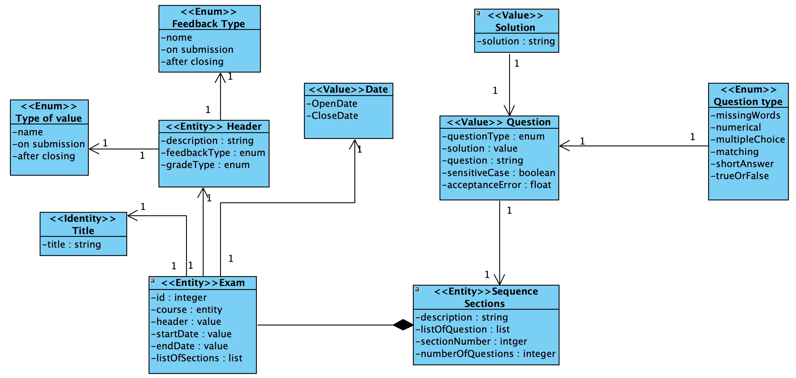
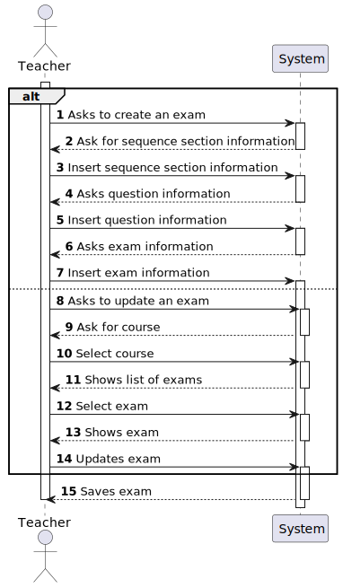
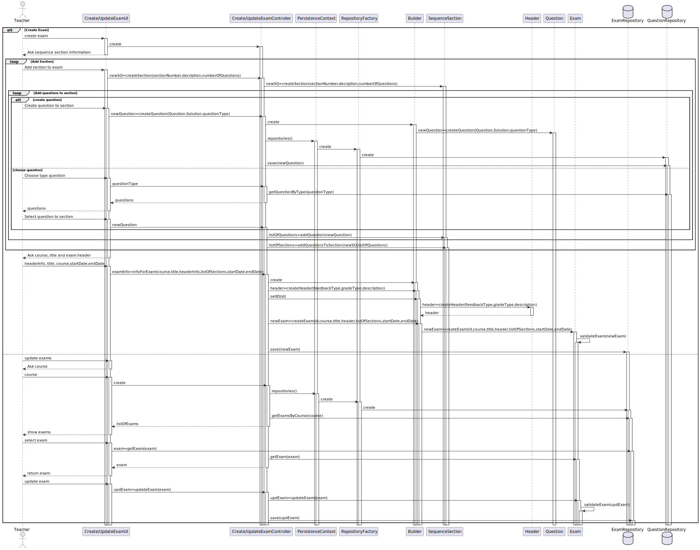
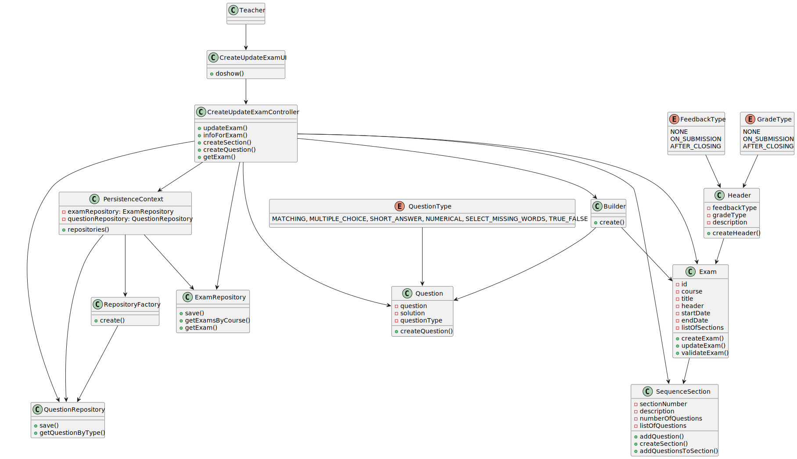

# US 2001 - As teacher, I want to create/update an exam.

*This is an example template*

## 1. Context

*Explain the context for this task. It is the first time the task is assigned to be developed or this tasks was incomplete in a previous sprint and is to be completed in this sprint? Are we fixing some bug?*

This US allows a teacher to create or update an existing exam for a specific course. 
The exam has a unique title and a header that may contain a textual description and has the feedback type (none, on-submission, after-closing) and the type of grade (none, on-submission, afterclosing). It may also contain a textual description to appear at the beginning of the
exam. After the header, the exam is composed of sequence of one or more sections. Each section is a group of questions and each section may also contain a textual description.
The exam will support questions of different types like:
    - Matching;
    - Multiple choice;
    - Short answer;
    - Numerical;
    - Select missing words;
    - True or false.

## 2. Requirements

*In this section you should present the functionality that is being developed, how do you understand it, as well as possible correlations to other requirements (i.e., dependencies).*

**US2001** As teacher, I want to create/update an exam.

-US2001.1 - This includes the specification of the exam (i.e., its structure, in accordance with a grammar for exams that is used to validate the specification of the exam).
-US2001.2 - The support for exams (its design, feedback and grading) must follow specific technical requirements, specified in LPROG.
-US2001.3 - The ANTLR tool should be used (https://www.antlr.org/).


## 3. Analysis

*In this section, the team should report the study/analysis/comparison that was done in order to take the best design decisions for the requirement. This section should also include supporting diagrams/artifacts (such as domain model; use case diagrams, etc.),*

- At anytime, the application user (authorized) may want to create or update an existing exam for a given course.
For that matter, repositories for the Questions and Exams needed to be created in other to assure the business domain and an abstraction layer between the domain code and the data storage.

- There is no dependency to other US.

**Input Data:**

* Typed data:
    * descriptions,
    * number of sections,
    * number of questions,
    * questions,
    * title,
    * start date,
    * end date.


* Selected data:
    * exam,
    * course,
    * type of grade
    * type of feedback.

**Output Data:**

* an Exam.


**Domain Model Excerpt**




## 4. Design

*In this sections, the team should present the solution design that was adopted to solve the requirement. This should include, at least, a diagram of the realization of the functionality (e.g., sequence diagram), a class diagram (presenting the classes that support the functionality), the identification and rational behind the applied design patterns and the specification of the main tests used to validade the functionality.*


### 4.1. Realization


**System Sequence Diagram (SSD)**




**Rationale**

| Interaction ID                                | Question: Which class is responsible for...    | Answer                      | Justification (with patterns)                                                                                   |
|:----------------------------------------------|:-----------------------------------------------|:----------------------------|:----------------------------------------------------------------------------------------------------------------|
| Step 1 - Asks to create an exam               | ... interacting with the actor?                | Create/UpdateExamUI         | Pure Fabrication: there is no reason to assign this responsibility to any existing class in the Domain Model.   |
|                                               | ... coordinating the US?                       | Create/UpdateExamController | Controller                                                                                                      |
| Step 2 - Ask for sequence section information | ... creating the Sequence Section?             | SequenceSection             | Creator (Rule 1).                                                                                               |
| Step 4 - Asks question information            | ... creating the Question?                     | Builder                     | Creates a complex object on a valid state.                                                                      |
|                                               | ... saving the Question?                       | PersistenceContext          | Allows the management of entity instances, and is responsible for tracking changes made on those entities.      |
| Step 6 - Asks exam information                | ... creating the Header?                       | Header                      | Creator (Rule 1).                                                                                               |
|                                               | ... creating the Exam?                         | Builder                     | Creates a complex object on a valid state.                                                                      |
| Step 8 - Asks to update an exam               | ... interacting with the actor?                | Create/UpdateExamUI         | Pure Fabrication: there is no reason to assign this responsibility to any existing class in the Domain Model.   |
| Step 9 - Ask for course                       | ... interacting with the actor?                | Create/UpdateExamUI         | Pure Fabrication: there is no reason to assign this responsibility to any existing class in the Domain Model.   |
| Step 11 - Shows list of exams                 | ... interacting and displaying the data?       | Create/UpdateExamUI         | Pure Fabrication: there is no reason to assign this responsibility to any existing class in the Domain Model.   |
|                                               | ... having the requested information?          | ExamRepository              | Abstracts data access by providing an abstraction layer between the domain code and the data storage mechanism. |
| Step 13 - Shows exam                          | ... interacting with the actor?                | Create/UpdateExamUI         | Pure Fabrication: there is no reason to assign this responsibility to any existing class in the Domain Model.   |
| Step 14 - Updates exam                        | ... updating the Exam?                         | Exam                        | Creator (Rule 1).                                                                                               |
| Step 14 - Saves exam                          | ... saving the Exam?                           | PersistenceContext          | Allows the management of entity instances, and is responsible for tracking changes made on those entities.      |


**Sequence Diagram (SD)**




### 4.2. Class Diagram



### 4.3. Applied Patterns
    - Controller
    - Builder
    - Persistence Context
    - Factory
    - Service
    - Repository
    
### 4.4. Tests

**Test 1:** * Verifies that it is not possible to create an Exam without an id.
**Test 2:** * Verifies that it is not possible to create an Exam without a title and a course.
**Test 3:** * Verifies that it is not possible to create an Exam without a course.
**Test 4:** * Verifies that it is not possible to create an Exam without a header.
**Test 5:** * Verifies that it is not possible to create an Exam without a section.
**Test 6:** * Verifies that it is not possible to create an Exam without a start date.
**Test 7:** * Verifies that it is not possible to create an Exam without an end Date.
**Test 8:** * Verifies that it is possible to create an Exam with all parameters filled.

```
@Test(expected = IllegalArgumentException.class)
public void ensureNullIsNotAllowed() {
	Example instance = new Example(null, null);
}
````

## 5. Implementation

*In this section the team should present, if necessary, some evidencies that the implementation is according to the design. It should also describe and explain other important artifacts necessary to fully understand the implementation like, for instance, configuration files.*

*It is also a best practice to include a listing (with a brief summary) of the major commits regarding this requirement.*

## 6. Integration/Demonstration

*In this section the team should describe the efforts realized in order to integrate this functionality with the other parts/components of the system*

*It is also important to explain any scripts or instructions required to execute an demonstrate this functionality*

## 7. Observations

*This section should be used to include any content that does not fit any of the previous sections.*

*The team should present here, for instance, a critical prespective on the developed work including the analysis of alternative solutioons or related works*

*The team should include in this section statements/references regarding third party works that were used in the development this work.*