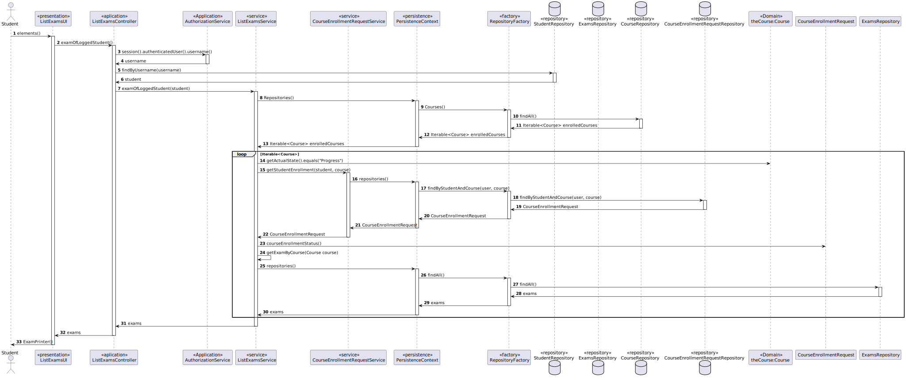

# US 2002: As Student, I want to view a list of my future exams

## 1. Requirements Engineering

### 1.1. User Story Description

As Student, I want to view a list of my future exams

### 1.2. Customer Specifications and Clarifications

**From the specifications document:**
* The system displays to a student his/her future exams

**From the client clarifications:**

> **Question**
>
>  **Answer**

### 1.3. Acceptance Criteria

* **FRE02** - List Exams - The system displays to a student his/her future exams

The user needs to be logged in the application as a student.

### 1.4. Found out Dependencies

* US1002 - Create Courses
* US1003 - Open and close enrollment in courses
* US1008 - Request Enrollment in courses
* US1009 - approve and reject student application to courses
* US2001 - create/update an exam

## 3. Analysis

* User Interface - This class is named ListExamsUI where it will allow the student to view the exams for the courses he is enrolled.
* Controller     - This class is named ListStudentExamsController where will be responsible for managing UI requests and performing the necessary actions to create the exams list.
* Repository     - In order to prepare the list of exams for the student we need to access the StudentUserRepository, the CourseRepository and CourseEnrollmentRequestRepository.
* Service        - ListStudentExamsService that prepare the data to only show a list with the exams for that particular student

*Below is the use case diagram to show the interactions between the manager and the system when open and close courses*

### 1.6 Domain Model

### 1.7. System Sequence Diagram (SSD)

### 1.8 Other Relevant Remarks

## 3. Design - User Story Realization

### 3.1. Rationale

| Interaction ID | Question: Which class is responsible for... | Answer                            | Justification (with patterns)                                                                                        |
|:---------------|:--------------------------------------------|:----------------------------------|:---------------------------------------------------------------------------------------------------------------------|
| Step 1         | ... interacting with the actor?             | ListExamsUI                       | UI pattern: ListExamsUI is responsible for interacting with the actor                                                |
|                | ... coordinating the US?                    | ListExamsController               | Controller pattern: ListExamsController is responsible for coordinating the use case and invoking necessary classes. |
| Step 3         | .. return the logged username               | AuthorizationService              | Service: Returns the username of the current logged user                                                             |
| Step 5         | .. return the Student                       | StudentRepository                 | Repository: StudentRepository returns the Student object for the given Username                                      |
| Step 7         | .. return the Exams of the Student          | ListExamsService                  | Service: Returns the list of exams of the student                                                                    | 
| Step 10        | .. find all courses the student is enrolled | CourseRepository                  | Repository: Returns the list of courses the student is enrolled                                                      |
| Step 18        | .. Return the Enrollment of the student     | CourseEnrollmentRequestRepository | Repository: Returns the CourseEnrollments of the logged student                                                      | 
| Step 27        | .. Return the exams of the student          | ExamsRepository                   | Repository: Returns the exams of the logged student for the courses he is enrolled                                   | 

### Systematization ##

software classes (i.e. Pure Fabrication) identified:

* ListExamsController
* AuthorizationService
* ListExamsService
* CourseEnrollmentRequestService
* StudentRepository
* ExamsRepository
* CourseRepository
* CourseEnrollmentRepository

## 3.2. Sequence Diagram (SD)

## 3.3. Class Diagram (CD)

# 4. Tests

...

## 5. Implementation

### ListExamsUI

    public class ListExamsUI extends AbstractListUI {
    
        private final ListStudentExamsController listStudentExamsController = new ListStudentExamsController();
    
    
        @Override
        public String headline() {
            return "List Exams";
        }
    
        @Override
        protected String emptyMessage() {
            return "No Exams available yet.\n";
        }
    
    
        @Override
        protected Iterable<Exam> elements() {
            return listStudentExamsController.examOfLoggedStudent();
        }
    
        @Override
        protected Visitor<Exam> elementPrinter() {
            return new ExamPrinter();
        }
    
        @Override
        protected String elementName() {
            return "Exam";
        }
    
        @Override
        protected String listHeader() {
            return String.format("#  %-30s%-20s%-20s%-30s%-20s", "Course", "Exam Name", "Teacher Name", "Start Date", "End Date");
        }
    }

### ListExamsController

    public class ListStudentExamsController {
    
        private final ListCoursesService courseService = new ListCoursesService();
        private final ListExamsService examService = new ListExamsService();
        private static final AuthorizationService authz = AuthzRegistry.authorizationService();
        StudentUserRepository studentRepository = PersistenceContext.repositories().studentUsers();
    
        public Iterable<Course> allCourses() {
            return courseService.allCourses();
        }
    
        public Iterable<Exam> allExams() {
    
            return examService.allExams();
        }
    
        public Iterable<Exam> examOfLoggedStudent() {
            Student student = loggedStudent();
            return examService.examOfLoggedStudent(student);
        }
    
        public Student loggedStudent() {
            Username loggedUser = authz.session().get().authenticatedUser().username();
    
            Student student = authz.session()
                    .map(UserSession::authenticatedUser)
                    .flatMap(systemUser -> studentRepository.findByUsername(loggedUser))
                    .orElse(null);
    
            return student;
        }
    }

### ListExamsService

    public class ListExamsService {
    
        private static final AuthorizationService authz = AuthzRegistry.authorizationService();
    
        public Iterable<Exam> allExams(){
            return PersistenceContext.repositories().exams().findAll();
        }
    
        private CourseEnrollmentRequestService enrollmentRequestService = new CourseEnrollmentRequestService();

        public List<Exam> examOfLoggedStudent(Student student) {
    
            List<Exam> loggedStudentExams = new ArrayList<>();
    
            Iterable<Course> enrolledCourses = PersistenceContext.repositories().courses().findAll();
    
            for (Course course : enrolledCourses) {
                if (course.getCourseState().getActualState().equals("Progress")) {
                    CourseEnrollmentRequest enrollmentRequest = enrollmentRequestService.getStudentEnrollment(student, course);
    
                    if (enrollmentRequest != null && enrollmentRequest.courseEnrollmentStatus() == EnrollmentStatus.ACCEPTED) {
                        List<Exam> exams = getExamByCourse(course);
                        loggedStudentExams.addAll(exams);
                    }
                }
            }
            return loggedStudentExams;
        }
    
        public List<Exam> getExamByCourse(Course course) {
            List<Exam> examListByCourse = new ArrayList<>();
            for (Exam exm : allExams()) {
                if (exm.getExamCourse().equals(course)) {
                    examListByCourse.add(exm);
                }
            }
            return examListByCourse;
        }
    }

## 6. Integration/Demonstration

/-

## 7. Observations

/-