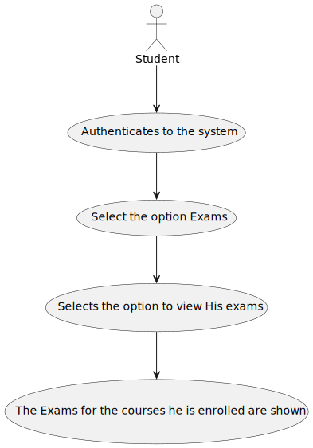

# US 2002: As Student, I want to view a list of my future exams

## 1. Requirements Engineering

### 1.1. User Story Description

As Student, I want to view a list of my future exams

### 1.2. Customer Specifications and Clarifications

**From the specifications document:**
* The system displays to a student his/her future exams

**From the client clarifications:**

> **Question**
>
>  **Answer**

### 1.3. Acceptance Criteria

* **FRE02** - List Exams - The system displays to a student his/her future exams

The user needs to be logged in the application as a student.

### 1.4. Found out Dependencies

*US1002 - Create Courses*
*US1003 - Open and close enrollment in courses*
*US1008 - Request Enrollment in courses*
*US1009 - approve and reject student application to courses*
*US2001 - create/update an exam*

## 3. Analysis

* User Interface - This class is named ListExamsUI where it will allow the student to view the exams for the courses he is enrolled.
* Controller     - This class is named ListStudentExamsController where will be responsible for managing UI requests and performing the necessary actions to create the exams list.
* Repository     - In order to prepare the list of exams for the student we need to access the StudentUserRepository, the CourseRepository and CourseEnrollmentRequestRepository.
* Service        - ListStudentExamsService that prepare the data to only show a list with the exams for that particular student

*Below is the use case diagram to show the interactions between the manager and the system when open and close courses*

### 1.6 Domain Model

### 1.7. System Sequence Diagram (SSD)

### 1.8 Other Relevant Remarks

## 3. Design - User Story Realization

### 3.1. Rationale

**SSD - Alternative 1 is adopted.**

| Interaction ID | Question: Which class is responsible for... | Answer                    | Justification (with patterns)                                                                                                                        |
|:---------------|:--------------------------------------------|:--------------------------|:-----------------------------------------------------------------------------------------------------------------------------------------------------|
| Step 1         | ... interacting with the actor?             | CreateRecurringLessonUI   | UI pattern: CreateRecurringLessonUI is responsible for interacting with the actor                     |
|                | ... coordinating the US?                    | RecurringLessonController | Controller pattern: RecurringLessonController is responsible for coordinating the use case and invoking necessary classes.                           |
| Step 2         | .. return list of courses                   | RecurringLessonRepository | Repository pattern: RecurringLessonRepository is responsible for saving the recurring lesson in the database.                                        |
| Step 3         | .. propagates the lesson and validates      | ScheduleLessonService     | Service: ScheduleRecurringLesson is responsible propagating the lesson for a certain frequency and validates the teacher availability for the lesson |

### Systematization ##

According to the taken rationale, the conceptual classes promoted to software classes are:

* RecurringLesson

Other software classes (i.e. Pure Fabrication) identified:

* CreateRecurringLessonController
* ScheduleLessonService
* RecurringLessonRepository

## 3.2. Sequence Diagram (SD)

## 3.3. Class Diagram (CD)

# 4. Tests

...

## 5. Implementation

*In this section the team should present, if necessary, some evidencies that the 
implementation is according to the design. It should also describe and explain other 
important artifacts necessary to fully understand the implementation like, for instance, 
configuration files.*

*It is also a best practice to include a listing (with a brief summary) 
of the major commits regarding this requirement.*

## 6. Integration/Demonstration

*In this section the team should describe the efforts realized in order to 
integrate this functionality with the other parts/components of the system*

*It is also important to explain any scripts or instructions required to execute an 
demonstrate this functionality*

## 7. Observations

*This section should be used to include any content that does not fit any of the previous sections.*

*The team should present here, for instance, a critical prespective on the developed work including the analysis of alternative solutioons or related works*

*The team should include in this section statements/references regarding third party works that were used in the development this work.*