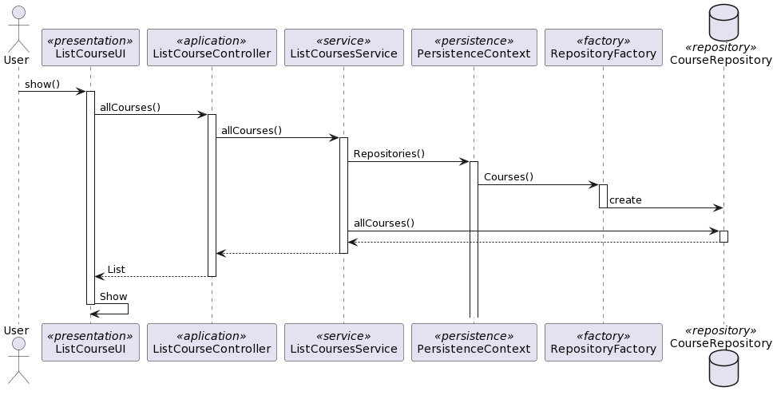

# US 1006: As User, I want to list all the exams in a Exam

## 1. Context

This task is to develop a new functionality to the system. 
It is not related to a bug fix or an incomplete task from a previous sprint. 
The team has been assigned this task for the first time.
Is an important task to be able to list Exams in the system

## 2. Requirements

**US 1006** As {Ator} I want to list all the Exams that are available to me

FRC05 - List Exams All users are able to execute this functionality.

É necessário o utilizador estar logado na aplicação e no menu inicial consegue listar todos os cursos existentes.
Esta US depende da *US1002- Create Exam*, só depois de os cursos serem criados é que é possivel listar.


## 3. Analysis

*In this section, the team should report the study/analysis/comparison 
that was done in order to take the best design decisions for the requirement. 
This section should also include supporting diagrams/artifacts 
(such as domain model; use case diagrams, etc.),*

To design the new functionality, we conducted an analysis of the requirements, using use case diagrams and sequence diagrams. 
We also identified the necessary classes and their relationships, creating a class diagram to represent the structure of the system.

## 4. Design


| Interaction ID | Question: Which class is responsible for... | Answer               | Justification (with patterns)                                                                                                        |
|:---------------|:--------------------------------------------|:---------------------|:-------------------------------------------------------------------------------------------------------------------------------------|
| Step 1         | ... interacting with the actor?             | ListExamUI         | UI pattern: ListExamUI is responsible for interacting with the actor by presenting the list of Exams.                            |
|                | ... coordinating the US?                    | ListExamController | Controller pattern: ListExamController is responsible for coordinating the use case and invoking necessary classes.                                                                                                                                     |
| Step 2         | ... Validate User                           | AppSettings          | Settings pattern: AppSettings is responsible for validating if the user is valid based on application settings.                                                                                               |
| Step 3         | .. return list of Exams                   | ExamRepository     | Repository pattern: ExamRepository is responsible for retrieving the list of Exams from the database.                                                                                                                                     |
| Step 4         | .. show the Exam to the user              | ListExamUI         | UI pattern: ListExamUI is responsible for presenting the Exams to the user.                                                                                                                                     |

### 4.1. Realization

### 4.2. Class Diagram



### 4.3. Applied Patterns

### 4.4. Tests

**ShowAllExams:** *Make sure that all Exams are shown when we choose the Exam list option.*

```
@Test(expected = IllegalArgumentException.class)
public void ensureNullIsNotAllowed() {
	Example instance = new Example(null, null);
}
````

## 5. Implementation

*In this section the team should present, if necessary, some evidencies that the 
implementation is according to the design. It should also describe and explain other 
important artifacts necessary to fully understand the implementation like, for instance, 
configuration files.*

*It is also a best practice to include a listing (with a brief summary) 
of the major commits regarding this requirement.*

## 6. Integration/Demonstration

*In this section the team should describe the efforts realized in order to 
integrate this functionality with the other parts/components of the system*

*It is also important to explain any scripts or instructions required to execute an 
demonstrate this functionality*

## 7. Observations

*This section should be used to include any content that does not fit any of the previous sections.*

*The team should present here, for instance, a critical prespective on the developed work including the analysis of alternative solutioons or related works*

*The team should include in this section statements/references regarding third party works that were used in the development this work.*