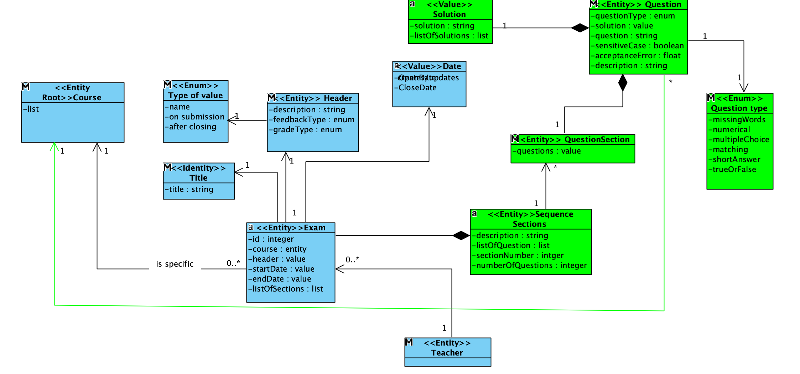
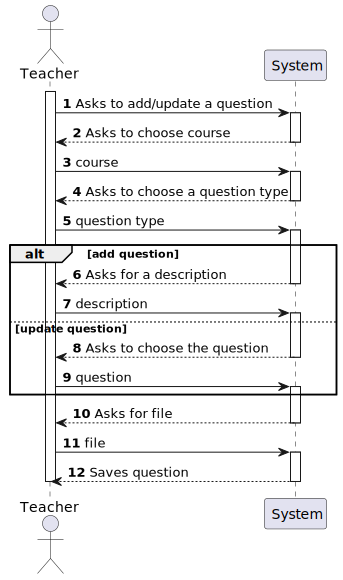
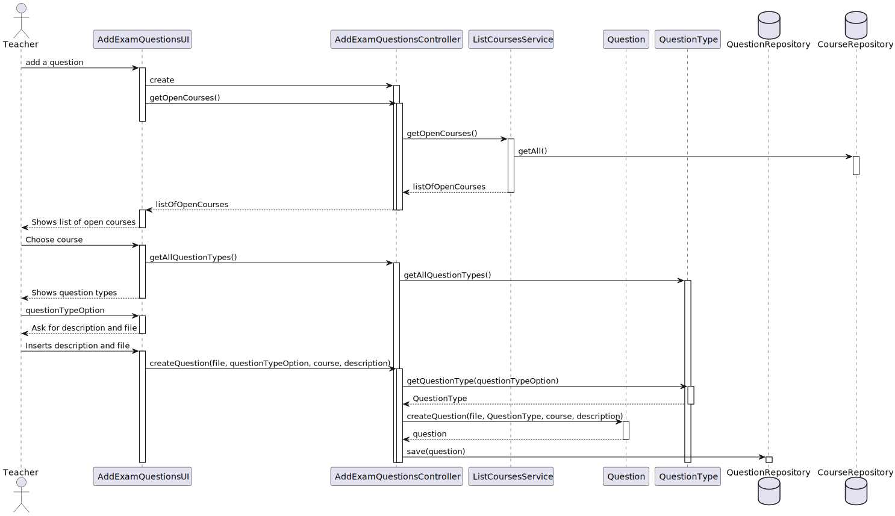
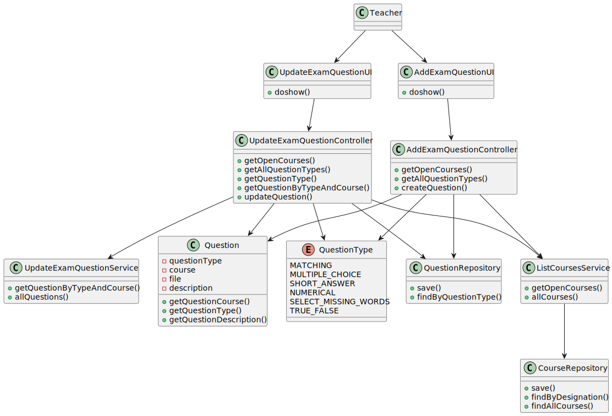

# US 2007 -  As Teacher I want to add/update exam questions to a repository of exam questions to be used in automatic formative exams.

*This is an example template*

## 1. Context

*Explain the context for this task. It is the first time the task is assigned to be developed or this tasks was incomplete in a previous sprint and is to be completed in this sprint? Are we fixing some bug?*

This US allows a teacher to add or update an existing question for a specific course formative exam.
The questions can be of different types:
    - Matching;
    - Multiple choice;
    - Short answer;
    - Numerical;
    - Select missing words;
    - True or false.

## 2. Requirements

*In this section you should present the functionality that is being developed, how do you understand it, as well as possible correlations to other requirements (i.e., dependencies).*

**US2007** As Teacher I want to add/update exam questions to a repository of exam questions to be used in automatic formative exams.

-US2007.1 - This includes only the specification of single questions to be used only in automatic formative exams, not on regular exams.
-US2007.2 - The support for exams (its design, feedback and grading) must follow specific technical requirements, specified in LPROG.
-US2007.3 - The ANTLR tool should be used (https://www.antlr.org/).

## 3. Analysis

*In this section, the team should report the study/analysis/comparison that was done in order to take the best design decisions for the requirement. This section should also include supporting diagrams/artifacts (such as domain model; use case diagrams, etc.),*

- At anytime, the application user (authorized) may want to add or update an existing question for a given course formative exam.
For that matter, a repository for Questions needs to be created in other to assure the business domain and an abstraction 
layer between the domain code and the data storage.

- There is no dependency to other US.

**Input Data:**

* Typed data:
    * file path,
    * description.


* Selected data:
    * question type,
    * question,
    * course

**Output Data:**

* a Question.


**Domain Model Excerpt**




## 4. Design

*In this sections, the team should present the solution design that was adopted to solve the requirement. This should include, at least, a diagram of the realization of the functionality (e.g., sequence diagram), a class diagram (presenting the classes that support the functionality), the identification and rational behind the applied design patterns and the specification of the main tests used to validade the functionality.*


### 4.1. Realization


**System Sequence Diagram (SSD)**




**Rationale**

| Interaction ID                          | Question: Which class is responsible for...    | Answer                                                      | Justification (with patterns)                                                                                                    |
|:----------------------------------------|:-----------------------------------------------|:------------------------------------------------------------|:---------------------------------------------------------------------------------------------------------------------------------|
| Step 1 - Asks to add/update a question  | ... interacting with the actor?                | AddExamQuestionsUI/UpdateExamQuestionsUI                    | Pure Fabrication: there is no reason to assign this responsibility to any existing class in the Domain Model.                    |
|                                         | ... coordinating the US?                       | AddExamQuestionsController/UpdateExamQuestionsController    | Controller                                                                                                                       |
| Step 2 - Asks to choose a course        | ... having the requested information?          | CourseRepository                                            | Abstracts data access by providing an abstraction layer between the domain code and the data storage mechanism.                  |
| Step 4 - Asks to choose a question type | ... having the requested information?          | QuestionType                                                | Creator (Rule 1).                                                                                                                |
| Step 6 - Asks to insert a description   | ... interacting with the actor?                | AddExamQuestionsUI/UpdateExamQuestionsUI                    | Pure Fabrication: there is no reason to assign this responsibility to any existing class in the Domain Model.                    |
| Step 8 - Ask to choose a question       | ... having the requested information?          | QuestionRepository                                          | Abstracts data access by providing an abstraction layer between the domain code and the data storage mechanism.                  |
| Step 10 - Asks for a file               | ... interacting with the actor?                | AddExamQuestionsUI/UpdateExamQuestionsUI                    | Pure Fabrication: there is no reason to assign this responsibility to any existing class in the Domain Model.                    |
|                                         | ... creating the Question?                     | Builder                                                     | Creates a complex object on a valid state.                                                                                       |
|                                         | ... updating the Question?                     | Question                                                    | Creator (Rule 1).                                                                                                                |
| Step 12 - Saves question                | ... saving the question?                       | PersistenceContext                                          | Allows the management of entity instances, and is responsible for tracking changes made on those entities.                       |


**Sequence Diagram (SD)**




*Note* Builders, factories, Persistence Context and other DDD domains weren't represented to lower the SD's complexity.

### 4.2. Class Diagram



### 4.3. Applied Patterns
    - Controller
    - Builder
    - Persistence Context
    - Repository Factory
    - Service
    - Repository
    
### 4.4. Tests

**Test 1:** * Verifies that it is not possible to create a Question without a type.
**Test 2:** * Verifies that it is not possible to create a Question without a course.
**Test 3:** * Verifies that it is not possible to create a Question without a description.
**Test 4:** * Verifies that it is not possible to create a Question without a file.
**Test 5:** * Verifies that it is possible to create a Question with all parameters filled.
**Test 6:** * Verifies that the Question has the correct type.
**Test 7:** * Verifies that the Question has the correct course.
**Test 8:** * Verifies that the Question has the correct description.
**Test 9:** * Verifies that the Question has the correct file.
**Test 10:** * Verifies that it is possible to add a Question.
**Test 11:** * Verifies that it is possible to update a Question.
**Test 12:** * Verifies that it is possible to compare a Questions.


```
    @Test
    public void testCreateQuestion() {

        Question question = new QuestionBuilder().theQuestionType(questionType1).theFile(file1).theCourse(course1)
                .theDescription(description1).build();

        assertEquals(questionType1, question.getQuestionType());
        assertEquals(course1, question.getQuestionCourse());
        assertEquals(file1, question.getFile());
        assertEquals(description1, question.getQuestionDescription());
    }
    
     @Test
    public void testIfQuestionCourseIsRequired() {
        assertThrows(IllegalArgumentException.class, () -> {
            Course nullCourse = null;
            Question.valueOf(questionType1, nullCourse, file1, description1);
        });
    }
    
    @Test
    public void testIfQuestionTypeIsCorrect(){
        assertEquals(questionType1, question1.getQuestionType());
        assertEquals(questionType2, question2.getQuestionType());
        assertNotEquals(questionType1, question2.getQuestionType());
    }
    
   
````

## 5. Implementation

*In this section the team should present, if necessary, some evidencies that the implementation is according to the design. It should also describe and explain other important artifacts necessary to fully understand the implementation like, for instance, configuration files.*

*It is also a best practice to include a listing (with a brief summary) of the major commits regarding this requirement.*

N/A

## 6. Integration/Demonstration

*In this section the team should describe the efforts realized in order to integrate this functionality with the other parts/components of the system*

*It is also important to explain any scripts or instructions required to execute an demonstrate this functionality*

N/A

## 7. Observations

*This section should be used to include any content that does not fit any of the previous sections.*

*The team should present here, for instance, a critical prespective on the developed work including the analysis of alternative solutioons or related works*

*The team should include in this section statements/references regarding third party works that were used in the development this work.*

N/A