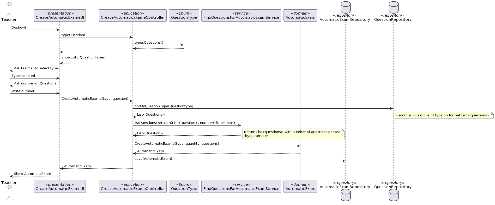

# US 1012 As Teacher, I want to create/update automatic formative exams

## 1. Context

*As a teacher it is useful to have a way to create exams automatically. This US answers that*

## 2. Requirements

The specification of formative exams is similar to regular exams, but the user specifies the type of questions to be inserted in the sections instead of the specific questions. When generating the automatic formative exam, the system should randomly create the questions (without repetition on a given exam). Also, formative exams do not have open and close dates. Feedback and grades are only provided at the end of the exam.
The support for exams (its design, feedback and grading) must follow specific technical requirements, specified in LPROG.
The ANTLR tool should be used (https://www.antlr.org/).

## 3. Analysis

**input Data:**
* Typed Data:
    * title
    * quantity of questions
    * type of questions

**Output Data:**
* Automatic exame crated and save on repo
## 4. Design

## Class diagram

## Use case diagram

## System sequence diagram

## Sequence diagram

### 4.1. Realization

### 4.3. Applied Patterns

### 4.4. Tests

**Test 1:** *Verifies that it is not possible to create an instance of the AutomaticExams class with null values.*
**Test 2:** *Verifies that it is not possible to create an AutomaticExams without questions.*

## 5. Implementation

## 6. Integration/Demonstration

## 7. Observations

*This US was left until last because it depends on the LPROG course and there was a misunderstanding about how to implement it. I hope it will be possible to implement it in the next Sprint*