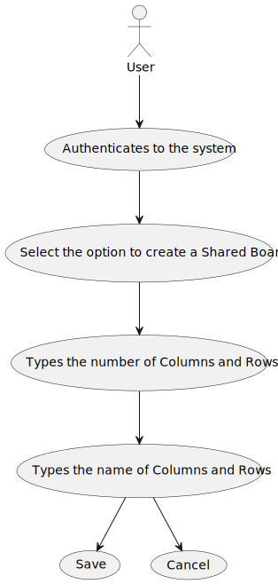
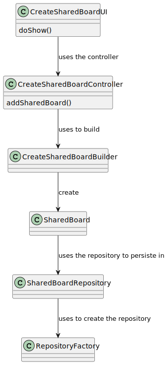
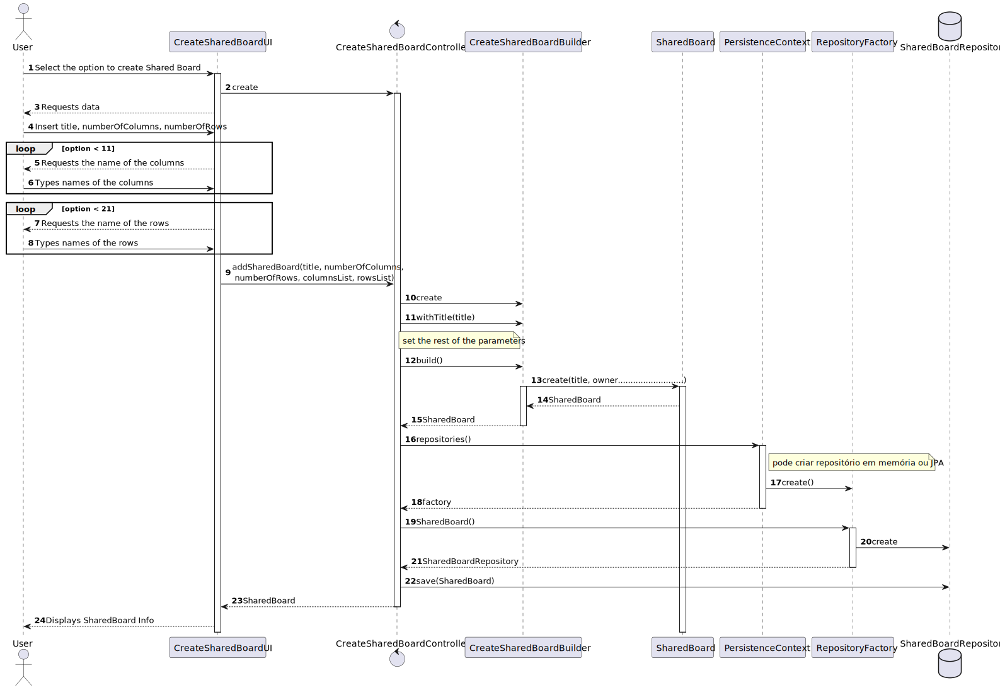

# US 3002 - As user, I want to create a board

*This is an example template*

## 1. Context

*The context for this task is the development of a new feature requested by the costumer. The purpose of this user story is to allow users to create a shared board, where they can add or remove other users and give the appropriate permissions.*

## 2. Requirements

*The requirement is to develop the functionality for creating a shared board for users. This user story is a new feature that has not been implemented before and has no dependencies on other requirements*

**US 3002** As User I want to create a board
1. The User authenticates in the system.
2. The User selects the option to create a new shared board.
3. The system presents a necessary information to create a shared board (number of the Columns and Rows, names of the columns and rows).
4. The user types the requested data and submit.
5. The system creates the shared board.
6. The system confirms the operation.


## 3. Analysis

In this section, the team should report the study/analysis/comparison that was done in order to take the best design decisions for the requirement. This section should also include supporting diagrams/artifacts (such as domain model; use case diagrams, etc.),

- At anytime, the application user (authorized) may want to create a sharedboard.

- There is no dependency to other US.

**Input Data:**

* Typed data:
    * Title of the board,
    * Number of the Columns,
    * Number of the Rows,
    * Name of the Columns,
    * Name of the Rows


* Selected data:
    * No selected data

**Output Data:**

* An SharedBoard.

Below is the use case diagram to show the interactions between the manager and the system when open and close courses*




**Domain Model Excerpt**


* User Interface - This class is named CreateSharedBoardUI where it will include a form to create a shared board. The form will include fields for the board name and users to add to the board.
* Controller     - This class is named CreateSharedBoardController where will be responsible for managing UI requests and performing the necessary actions to create the shared board.
* Repository     - This class is named SharedBoardRepository where it will store the data about the shared boards

*Below is the use case diagram to show the interactions between the user and the system when creating a shared board*


## 4. Design

*In this sections, the team should present the solution design that was adopted to solve the requirement. This should include, at least, a diagram of the realization of the functionality (e.g., sequence diagram), a class diagram (presenting the classes that support the functionality), the identification and rational behind the applied design patterns and the specification of the main tests used to validade the functionality.*

### 4.1. Realization


| Interaction ID | Question: Which class is responsible for... | Answer                      | Justification (with patterns)                                                                                                |
|:---------------|:--------------------------------------------|:----------------------------|:-----------------------------------------------------------------------------------------------------------------------------|
| Step 1         | ... interacting with the actor?             | UpdateCourseStateUI         | UI pattern: UpdateCourseState is responsible for interacting with the actor to update the state of courses.                  |
|                | ... coordinating the US?                    | UpdateCourseStateController | Controller pattern: UpdateCourseStateController is responsible for coordinating the use case and invoking necessary classes. |
| Step 2         | ... Validate User                           | AppSettings                 | Settings pattern: AppSettings is responsible for validating if the user is valid based on application settings.              |
| Step 3         | .. return list of courses                   | CourseRepository            | Repository pattern: CourseRepository is responsible for retrieving the list of courses from the database.                    |
| Step 4         | .. show the course to the user              | ListCourseUI                | UI pattern: ListCourseUI is responsible for presenting the courses to the user.                                              |


### 4.2. Class Diagram



### 4.3 Sequence Diagran



### 4.4. Applied Patterns
  - Controller
  - Builder
  - Persistence Context
  - Repository

### 4.5. Tests

**Test 1:** *Verifies that it is not possible to create an instance of the SharedBoard class with the same title.*

```
 @Test
    public void testIfSharedBoardIsEqualsToAnotherSharedBoard(){
        assertTrue(board1.sameAs(board1));
        assertFalse(board1.sameAs(board2));
    }
````


## 5. Implementation

*In this section the team should present, if necessary, some evidencies that the implementation is according to the design. It should also describe and explain other important artifacts necessary to fully understand the implementation like, for instance, configuration files.*

*It is also a best practice to include a listing (with a brief summary) of the major commits regarding this requirement.*

## 6. Integration/Demonstration

*In this section the team should describe the efforts realized in order to integrate this functionality with the other parts/components of the system*

*It is also important to explain any scripts or instructions required to execute an demonstrate this functionality*

## 7. Observations

*This section should be used to include any content that does not fit any of the previous sections.*

*The team should present here, for instance, a critical prespective on the developed work including the analysis of alternative solutioons or related works*

*The team should include in this section statements/references regarding third party works that were used in the development this work.*