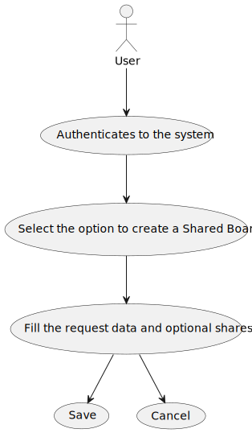
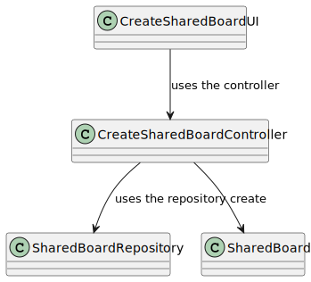
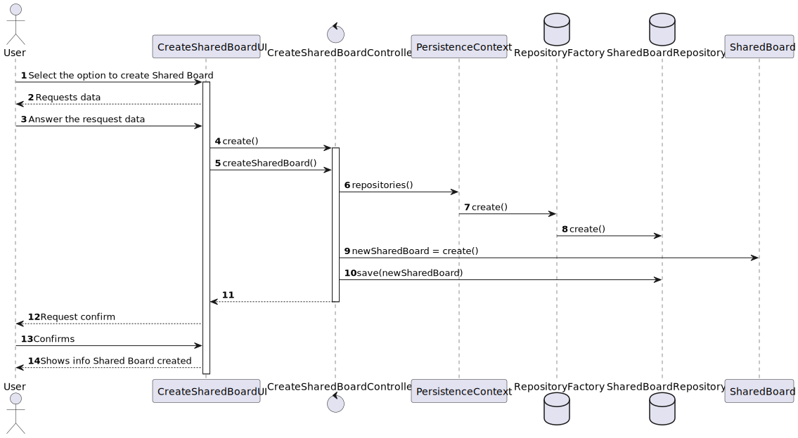

# US 3002 - As user, I want to create a board

*This is an example template*

## 1. Context

*The context for this task is the development of a new feature requested by the costumer. The purpose of this user story is to allow users to create a shared board, where they can add or remove other users and give the appropriate permissions.*

## 2. Requirements

*The requirement is to develop the functionality for creating a shared board for users. This user story is a new feature that has not been implemented before and has no dependencies on other requirements*

**US 3002** As User I want to create a board
1. The User authenticates in the system.
2. The User selects the option to create a new shared board.
3. The system presents a necessary information to create a shared board for the user to fill and can add members to the shared board.
4. The user fills information requested and submit.
5. The system creates the shared board.
6. The system displays a status create confirmation message.


## 3. Analysis

* User Interface - This class is named CreateSharedBoardUI where it will include a form to create a shared board. The form will include fields for the board name and users to add to the board.
* Controller     - This class is named CreateSharedBoardController where will be responsible for managing UI requests and performing the necessary actions to create the shared board.
* Repository     - This class is named SharedBoardRepository where it will store the data about the shared boards

*Below is the use case diagram to show the interactions between the user and the system when creating a shared board*



## 4. Design

*In this sections, the team should present the solution design that was adopted to solve the requirement. This should include, at least, a diagram of the realization of the functionality (e.g., sequence diagram), a class diagram (presenting the classes that support the functionality), the identification and rational behind the applied design patterns and the specification of the main tests used to validade the functionality.*

### 4.1. Realization

### 4.2. Class Diagram



### 4.3 Sequence Diagran



### 4.4. Applied Patterns

### 4.5. Tests

**Test 1:** *Verifies that it is not possible to create an instance of the Example class with null values.*

```
@Test(expected = IllegalArgumentException.class)
public void ensureNullIsNotAllowed() {
	Example instance = new Example(null, null);
}
````

## 5. Implementation

*In this section the team should present, if necessary, some evidencies that the implementation is according to the design. It should also describe and explain other important artifacts necessary to fully understand the implementation like, for instance, configuration files.*

*It is also a best practice to include a listing (with a brief summary) of the major commits regarding this requirement.*

## 6. Integration/Demonstration

*In this section the team should describe the efforts realized in order to integrate this functionality with the other parts/components of the system*

*It is also important to explain any scripts or instructions required to execute an demonstrate this functionality*

## 7. Observations

*This section should be used to include any content that does not fit any of the previous sections.*

*The team should present here, for instance, a critical prespective on the developed work including the analysis of alternative solutioons or related works*

*The team should include in this section statements/references regarding third party works that were used in the development this work.*