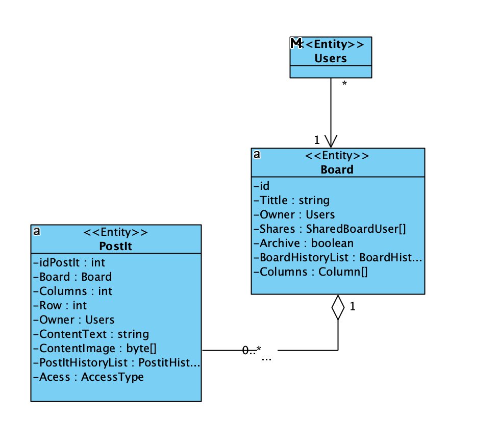

# US 3003 -  As Project Manager, I want the team to "explore" the synchronization problems related to the shyncronization of shared boards and design a conceptual solution based on practical evidence.

*This is an example template*

## 1. Context

*Explain the context for this task. It is the first time the task is assigned to be developed or this tasks was incomplete in a previous sprint and is to be completed in this sprint? Are we fixing some bug?*

As Project Manager, I want the team to "explore" the synchronization problems related to the synchronization of shared boards and design a conceptual solution based on practical evidence.

This US addresses the problems related with the synchronization of the shared Boards. When a client/User is accessing a shared Board and writing in a Post-It,
no other Client/User should have access to that post-it. The other user must wait for the first one to save the changes.
This way, no information is lost, and it's assured that the post-it is always in an updated state.

## 2. Requirements

*In this section you should present the functionality that is being developed, how do you understand it, as well as possible correlations to other requirements (i.e., dependencies).*

**US3003** As Project Manager, I want the team to "explore" the synchronization problems related to the shyncronization of shared boards and design a conceptual solution based on practical evidence.

-US3003.1 - This functional part of the system has very specific technical requirements, particularly some concerns about synchronization problems.
-US3003.2 - In fact, several clients will try to concurrently update boards. As such, to explore and study this concurrency scenario a "model" of a solution must be implemented and evaluated in C, using processes and semaphores.


## 3. Analysis

*In this section, the team should report the study/analysis/comparison that was done in order to take the best design decisions for the requirement. This section should also include supporting diagrams/artifacts (such as domain model; use case diagrams, etc.),*

- At anytime, the application user (authorized) may want to access an existing post-it of a shared Board.
  For that matter, the access to write in a certain post-it must be exclusive, one user, at a time, can edit the post-it content, so mutex semaphores must be created
  for every post-it available.
- This way, no information is lost, and it's assured that the post-it is always in an updated state.
- It's a must to have this US implemented:
  US3002 - As User, I want to create a board.

**Input Data:**
    * content.

**Output Data:**

* a post-it updated.


**Domain Model Excerpt**




## 4. Design

*In this sections, the team should present the solution design that was adopted to solve the requirement. This should include, at least, a diagram of the realization of the functionality (e.g., sequence diagram), a class diagram (presenting the classes that support the functionality), the identification and rational behind the applied design patterns and the specification of the main tests used to validade the functionality.*


### 4.1. Realization


**System Sequence Diagram (SSD)**


**Rationale**

| Interaction ID                      | Question: Which class is responsible for...            | Answer                               | Justification (with patterns)                                                                                 |
|:------------------------------------|:-------------------------------------------------------|:-------------------------------------|:--------------------------------------------------------------------------------------------------------------|
| Step 1 - Asks access to SharedBoard | ... interacting with the actor?                        | SharedBoardSynchronizationUI         | Pure Fabrication: there is no reason to assign this responsibility to any existing class in the Domain Model. |
|                                     | ... coordinating the US?                               | SharedBoardSynchronizationController | Controller                                                                                                    |
| Step 4 - Asks access to Post-It     | ... explore synchronization problems                   | Semaphores                           | For synchronization access to post-its (critical zone).                                                       |
|                                     | ... allow multiple users to access the shared board    | Parent                               | Create multiple child processes.                                                                              |
|                                     | ... ensure mutual exclusion while writing to post-its  | Semaphores                           | For synchronization access to post-its (critical zone).                                                       |
|                                     | ... print the contents of post-its on the shared board | Parent/SharedBoardSynchronizationUI  | Display post-it contents after child processes finish                                                         |

**Sequence Diagram (SD)**


### 4.2. Class Diagram


### 4.3. Applied Patterns
    N/A
    
### 4.4. Tests

**Test** * Verifies that at the end, the number of updates of the post-it boards must be the same as the users access request.

```
    // Processo pai
    printf("\nConteúdo dos post-its:\n");
    for (i = 0; i < NUM_POST_ITS; i++) {
        sum=sum+board->post_its[i];
        printf("Post-it %d: %d\n", i+1, board->post_its[i]);
    }
    printf("Numero de acesso= %d\n",sum);
    
   
````

## 5. Implementation

*In this section the team should present, if necessary, some evidencies that the implementation is according to the design. It should also describe and explain other important artifacts necessary to fully understand the implementation like, for instance, configuration files.*

*It is also a best practice to include a listing (with a brief summary) of the major commits regarding this requirement.*

N/A

## 6. Integration/Demonstration

*In this section the team should describe the efforts realized in order to integrate this functionality with the other parts/components of the system*

*It is also important to explain any scripts or instructions required to execute an demonstrate this functionality*

N/A

## 7. Observations

*This section should be used to include any content that does not fit any of the previous sections.*

*The team should present here, for instance, a critical prespective on the developed work including the analysis of alternative solutioons or related works*

*The team should include in this section statements/references regarding third party works that were used in the development this work.*

N/A