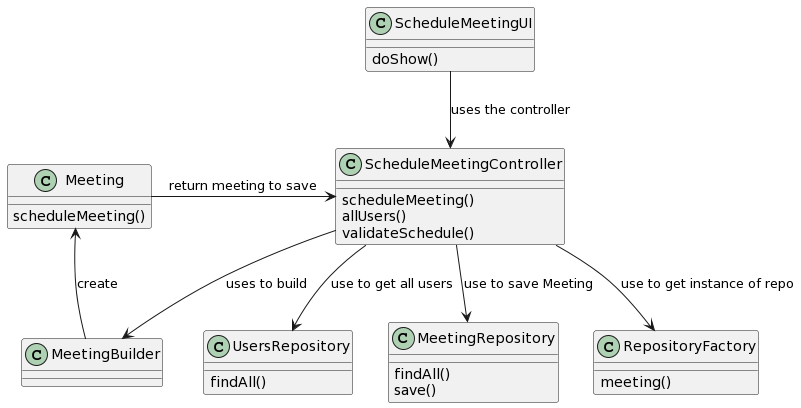
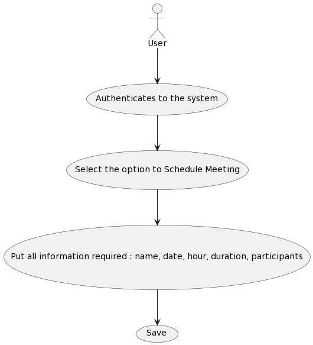
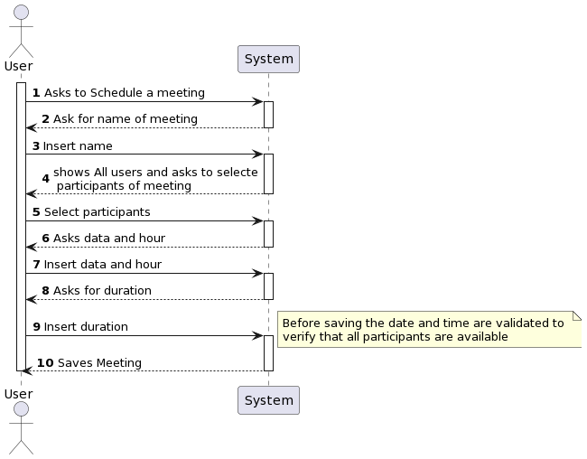

# US4001 As User, I want to schedule a meeting.

## 1. Context

*In the application it is necessary to have a way to schedule meetings between several users and this US solves that problem. There can't be meetings about posts but several users can be in the same meeting.
The same user cannot be in meetings that happen at the same time.*

## 2. Requirements

• FRM01 - Schedule a Meeting A user schedules a meeting. The system must check if
all participants are available and send invitations to participants.

## 3. Analysis

**input Data:**
* Typed Data:
    * name
    * participants
    * date
    * hour
    * duration

**Output Data:**
* Meeting is save on repository
## 4. Design

## Class diagram

## Use case diagram

## Sequence diagram

## System sequence diagram

*Rational*

| Interaction ID | Question: Which class is responsible for... | Answer                                         | Justification (with patterns)                                                                              |
|:---------------|:--------------------------------------------|:-----------------------------------------------|:-----------------------------------------------------------------------------------------------------------|
| Step 1         | ... interacting with the actor?             | ScheduleMeetingUI                              | UI layer interacts with the user, following the UI pattern.                                                |
|                | ... coordinating the US?                    | ScheduleMeetingController                      | Controller handles the use case, following the Application pattern.                                        |
| Step 2         | get participants to show                    | ScheduleMeetingController/ userRepository      |                                                                                                            |
| Step 3         | show course participants for user           | ScheduleMeetingUI                              |                                                                                                            |
| Step 4         | Create Meeting?                             | MeetingBuilder                                 | Domain service or factory responsible for creating a Meeting in the domain.                                |
| Step 5         | Saving the Meeting                          | ScheduleMeetingController / PersistenceContext | Controller collaborates with the PersistenceContext to persist the Meeting.                                |
| Step 6         | show meeting information for user           | ScheduleMeetingUI                              | UI layer displays the course information to the user.                                                      |

### 4.1. Realization

### 4.3. Applied Patterns

*UI Pattern*
*Application patters (controller)*
*Domain Service*
*Factory*
*Persistence patterns*

### 4.4. Tests

## 5. Implementation

## 6. Integration/Demonstration

## 7. Observations

*This US is implemented in a way that validates if users have other meetings at the same time but does not validate if they have classes at the time of the meeting, it is a point to be improved in the next sprint.*

