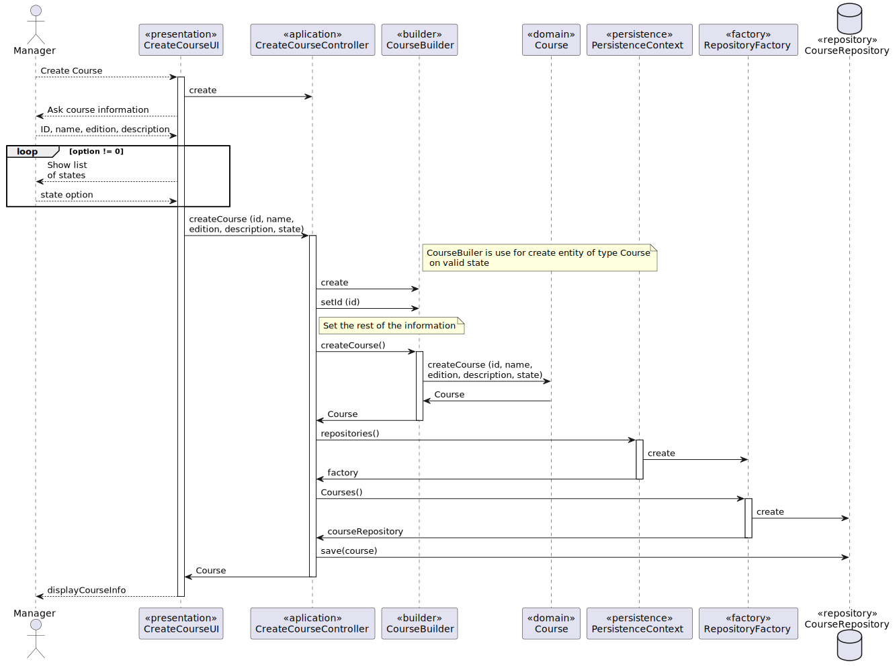

# US 1002 As Manager, I want to create courses

## 1. Context

*FRC01 - Create Course Different editions of a course are to be considered different courses (e.g., Intro-Math-Sem01, Intro-Math-Sem02). Only managers are able to execute this functionality.*

## 2. Requirements

**US 1002** As Manager, I Want to create courses

- US 1002.1. -Create Course Different editions of a course are to be considered different courses (e.g., Intro-Math-Sem01, Intro-Math-Sem02). 
                Only managers are able to execute this functionality.

## 3. Analysis

*In this section, the team should report the study/analysis/comparison that was done in order to take the best design decisions for the requirement. This section should also include supporting diagrams/artifacts (such as domain model; use case diagrams, etc.),*

**input Data:**
* Typed Data:
    * id
    * name
    * description
    * state
    * edition
  
**Output Data:**
* Course is created and save on repository

## 4. Design

*In this sections, the team should present the solution design that was adopted to solve the requirement. This should include, at least, a diagram of the realization of the functionality (e.g., sequence diagram), a class diagram (presenting the classes that support the functionality), the identification and rational behind the applied design patterns and the specification of the main tests used to validade the functionality.*
*Rational*

| Interaction ID | Question: Which class is responsible for...| Answer| Justification (with patterns)|
|:---------------|:-------------------------------------------|:------|:-----------------------------|
| Step 1| ... interacting with the actor? | 

### 4.1. Realization

### 4.2. Class Diagram



### 4.3. Applied Patterns

### 4.4. Tests

**Test 1:** *Verifies that it is not possible to create a Course without id.*
**Test 2:** *Verifies that it is not possible to create a Course without name.*
**Test 3:** *Verifies that it is not possible to create a Course without description.*
**Test 4:** *Verifies that it is not possible to create a Course without edition.*
**Test 5:** *Verifies that it is not possible to create a Course without state.*
**Test 6:** *Verifies that it is possible to create a Course with all parameters fill.*


```
@Test(expected = IllegalArgumentException.class)
public void ensureNullIsNotAllowed() {
	Example instance = new Example(null, null);
}
````

## 5. Implementation

*In this section the team should present, if necessary, some evidencies that the implementation is according to the design. It should also describe and explain other important artifacts necessary to fully understand the implementation like, for instance, configuration files.*

*It is also a best practice to include a listing (with a brief summary) of the major commits regarding this requirement.*

## 6. Integration/Demonstration

*In this section the team should describe the efforts realized in order to integrate this functionality with the other parts/components of the system*

*It is also important to explain any scripts or instructions required to execute an demonstrate this functionality*

## 7. Observations

*This section should be used to include any content that does not fit any of the previous sections.*

*The team should present here, for instance, a critical prespective on the developed work including the analysis of alternative solutioons or related works*

*The team should include in this section statements/references regarding third party works that were used in the development this work.*