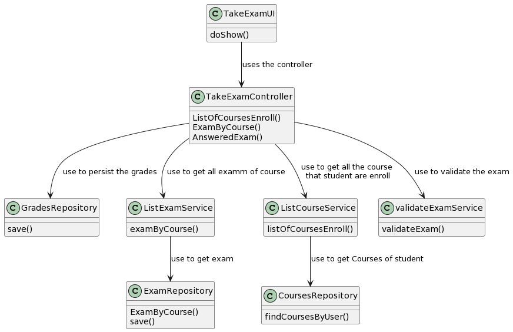

# US4002 As User, I want to take a exam

## 1. Context

*In this application we want the user to be able to take exams and get feedback with the grade after completing them.
This US answers that criterion*

## 2. Requirements

*A Student takes an exam and answer its questions.
At the end of the exam, the system should display the feedback and result (i.e., grade) of the exam.
The feedback and grade of the exam should be automatically calculated by a parser based on the grammar defined for exams structure.*

## 3. Analysis

## System sequence diagram

**input Data:**
* Typed Data:
  * Selected exam
  * Student

**Output Data:**
* Exam completed
* Grade

## 4. Design

## Class diagram

## Use case diagram

## Sequence diagram

### 4.1. Realization

### 4.3. Applied Patterns

*UI Pattern*
*Application patters (controller)*
*Domain Service*
*Persistence patterns*

### 4.4. Tests

## 5. Implementation

## 6. Integration/Demonstration

## 7. Observations

