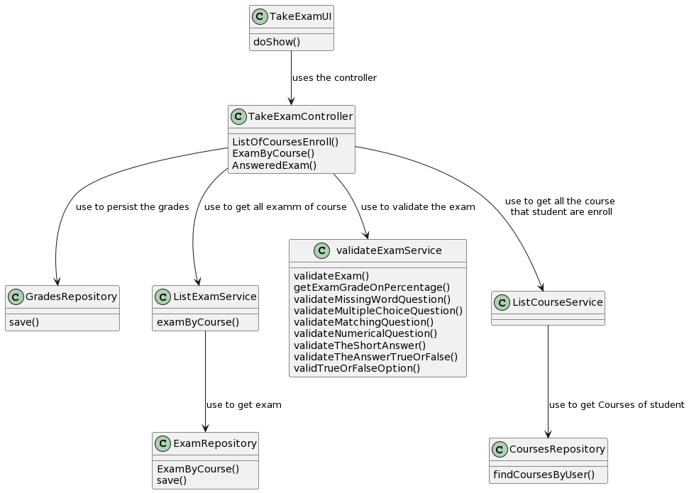
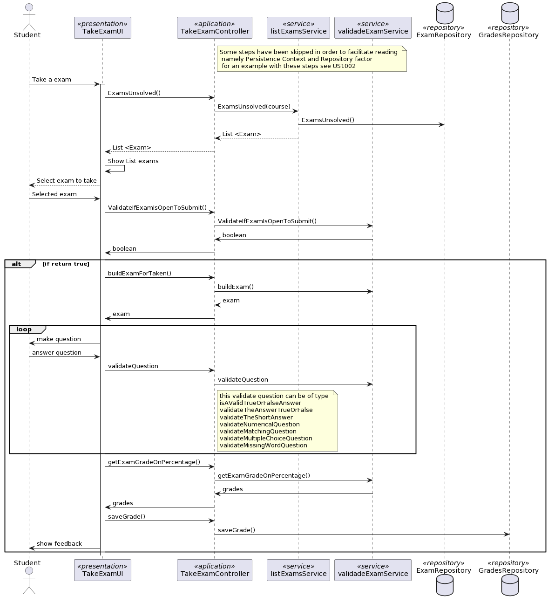

# US 2004 As Student, I want to take an exam

## 1. Context

This user story came to fill the need to have an exam validator in the application.
With this it was also created a way for students to take exams and receive feedback automatically at the end of the exam.

### 2 Customer Specifications and Clarifications

**From the client clarifications:**

> **Question:**
> Dear client,
> After discussing these questions with the OT teacher, we would like to know your opinion about the grades.
> First we would like to know if you wish that the grades are saved in the program database. Second we would like for you to clarify the expected flow of both feedback and grade types.

> **Answer:**
> Hello Inês.
> Regarding the first question, if you do not save the grades how do you implement the functionalities of FRE05 and FRE06?
> Regarding the second question, the ideia is to have something very similar to the Moodle platform. According to the specification "The system must also support the automatic production of feedback and grading for the answers given by students when they take the exam. Usually this is done at the end of the exam." So, the grade and the feedback should be provided only and the end of the exam. At the end of the exam, the system should display to the student the resulting grade of the exam as well as the grade and feedback for each question/answer.
> You may find a simple workflow on how to create moodle tests(quiz) in https://youtu.be/dCDPS7ufGuQ
> Regarding grades, each question will have points when the answer is correct. If you sum all the points form all the answers you will have the grade of the exam.
> Please consider only the question types that are presented in the specification document. For each question type you will find further details on the specifics of the grading logic.

> **Question**
> Boa noite,
>A propósito das US's 2004 e 2009, de que forma é que os exames serão apresentados ao aluno para o mesmo os realizar? Será semelhante às boards, em que será criada uma página em Java Script?

> **Answer**
> Bom dia.
>Documento de especificação, página 11, Figura 4.1. É apresentada uma visão da arquitetura da solução.
>Apenas a aplicação "shared board app" implementa um servidor http para servir o "board viewer". Todas as outras funcionalidades da solução devem estar distribuídas pelas outras "apps", que devem ser java console applications. Ou seja, a "user interface" para a funcionalidade dos exames deve ser implementada como uma console application. A referencia aos "quiz" do moodle é apenas para ilustrar quais as funcionalidades pretendidas. Mas a sua implementação não necessita de ser realizada em HTML (ou seja, não é esperado que o façam).
>Pensava que isso estava claro no documento da especificação.
> **Question**
>Our group has a following question: when a student finished taking exam, will he want at some point review the exam and see his answers? Do we need to save the exam with the answers of a certain student to be able to show it later (if needed), or should we just calculate the final grade and show feedback for each question (if applicable)?
>Another question is about types of feedback: on-submission means on submission of a question or the whole exam?
> **Answer**
>when a student finished taking exam, will he want at some point review the exam and see his answers?
>This is not required.
>Do we need to save the exam with the answers of a certain student to be able to show it later (if needed), or should we just calculate the final grade and show feedback for each question (if applicable)?
>Just calculate the final grade and show feedback for each question. Unless saving of the answers is required as a technical solution for some other aspect of your solution you do not need to save the answers.
>Another question is about types of feedback: on-submission means on submission of a question or the whole exam?
>On submission of the whole exam.

## 2. Requirements

The requirements are.
- The student must be logged into the application
- The student must be associated with one or more courses.
- The teacher must add exams and associate them to the course.
- The exams must be validated and stored in the database.
- The student can't have already taken the exam.
- The student's final grade must be stored in the database.

## 3. Analysis

A Student takes an exam and answer its questions.
At the end of the exam, the system should display the feedback and result (i.e., grade) of the exam.
The feedback and grade of the exam should be automatically calculated by a parser based on the grammar
defined for exams structure.

Only valid exams can be stored in the database, so when the student chooses the exam he wants to take, all of them
are ready to be taken.
When the exam is chosen the file of type Map <String, Map <String,Object>> is taken.
The exam cannot be taken outside the submission period.

## 4. Design

## Class diagram

## Use case diagram

### 4.2. Sequence diagram

### 4.4. Tests

## 5. Implementation

## 6. Integration/Demonstration

## 7. Observations

