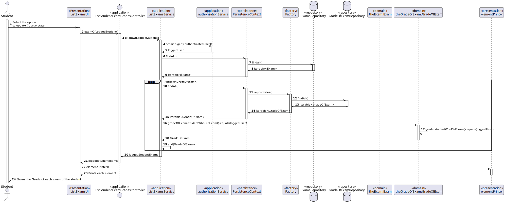
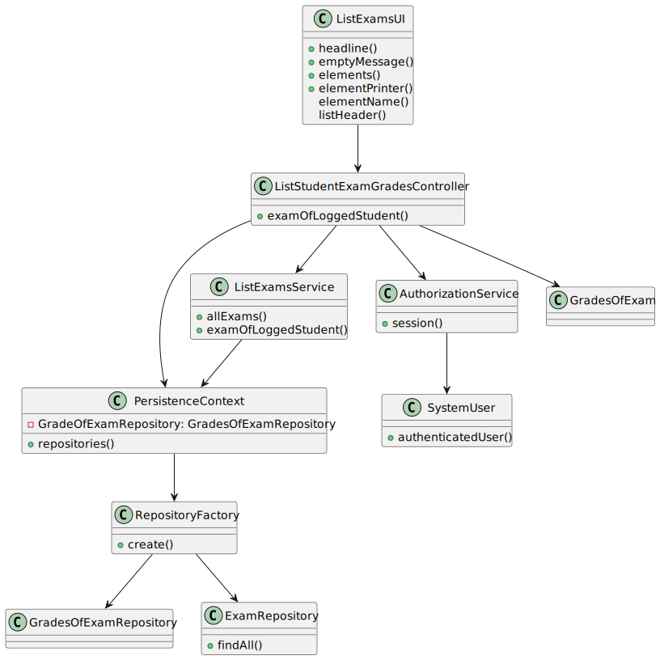

# US2005 - As Student, I want to view a list of my grades

## 1. Requirements Engineering

### 1.1. User Story Description

The student want to view the list of his grades.

### 1.2. Customer Specifications and Clarifications

**From the specifications document:**
* The student want to view the list of his grades.

**From the client clarifications:**

> **Question**
>
>  **Answer**

### 1.3. Acceptance Criteria

* **FRE05:** The system displays to a students his/her grades

The user needs to be logged in the application as a Student.

### 1.4. Found out Dependencies

* There is a dependency to "US1001" - As Manager, I want to be able to register, disable/enable, and list users of the system (Teachers and Students, as well as Managers)
* There is a dependency to "US1002" - As Manager, I want to create courses
* There is a dependency to "US1003" - As Manager, I want to open and close enrollements in courses
* There is a dependency to "US1008" - As Student, I want to request my enrollment in a course
* There is a dependency to "US1009" - As Manager, I want to approve or reject students applications to courses
* There is a dependenct to "US2001" - As Teacher, I want to create/update an exam

### 1.5 Input and Output Data

**Input Data:**
-/

**Output Data:**

* Course Enrollment

### Analysis

* User Interface - This class is named ListExamsUI where it will allow the Student to view his exams grades
* Controller     - This class is named ListStudentExamGradesController where will be responsible for managing UI requests and performing the necessary actions to show the grades of the student
* Service        - ListExamsService prepare the list of all logged student exams

*Below is the use case diagram to show the interactions between the manager and the system

### 1.6. Domain Model

### 1.7. System Sequence Diagram (SSD)

### 1.8. Other Relevant Remarks

## 3. Design - User Story Realization

### 3.1. Rationale

| Interaction ID | Question: Which class is responsible for...            | Answer                          | Justification (with patterns)                                                                                                    |
|:---------------|:-------------------------------------------------------|:--------------------------------|:---------------------------------------------------------------------------------------------------------------------------------|
| Step 1         | ... interacting with the actor?                        | ListExamsUI                     | UI pattern: ListExamsService is responsible for interacting with the actor                                                       |
|                | ... coordinating the US?                               | ListStudentExamGradesController | Controller pattern: ListStudentExamGradesController is responsible for coordinating the use case and invoking necessary classes. |
| Step 3         | ... Preparing the information about the student grades | ListExamsService                | Service: ListStudentExamGradesController is responsible for listing all the exam grades for the logged student                   |
| Step 4         | ... Retrieves the information of the logged student    | AuthorizationService            | Service: AuthorizationService is responsible for retrieving the student logged in                                                |
| Step 7         | ... return the exams                                   | ExamsRepository                 | repository: ExamsRepository returns the Exams in the database                                                                    |
| Step 12        | ... return the grade of exams                          | GradeOfExamsRepository          | repository: GradeOfExamsRepository returns the GradeOfExams in the database                                                      |

### Systematization ##

software classes (i.e. Pure Fabrication) identified:

* ListStudentExamGradesController
* ListExamsService

## 3.2. Sequence Diagram (SD)

## 3.3. Class Diagram (CD)

# 4. Tests

/-

# 5. Construction (Implementation)

### ListExamGradesUI

    public class ListExamsGradesUI extends AbstractListUI {
    
        private final ListStudentExamGradesController listStudentExamGradesController = new ListStudentExamGradesController();
    
    
        @Override
        public String headline() {
            return "List Exams Grades";
        }
    
        @Override
        protected String emptyMessage() {
            return "No Exams grades available yet.\n";
        }
    
    
        @Override
        protected Iterable<GradeOfExam> elements() {
            return listStudentExamGradesController.examGradesOfLoggedStudent();
        }
    
        @Override
        protected Visitor<GradeOfExam> elementPrinter() {
            return new ExamGradePrinter();
        }
    
        @Override
        protected String elementName() {
            return "Exam Grades";
        }
    
        @Override
        protected String listHeader() {
            return String.format("#  %-30s%-20s%-20s%-20s", "Course", "Exam Name", "Grade", "Student Name");
        }
    }

### ListExamGradesController

    public class ListStudentExamGradesController {
    
        private final ListExamsService service = new ListExamsService();
    
        public Iterable<Exam> allExams() {
    
            return service.allExams();
        }
    
        public Iterable<GradeOfExam> examGradesOfLoggedStudent() {
            return service.examGradesOfLoggedStudent();
        }
    }

### ListExamService

    public class ListExamsService {
    
        private static final AuthorizationService authz = AuthzRegistry.authorizationService();
    
        public Iterable<Exam> allExams(){
            return PersistenceContext.repositories().exams().findAll();
        }
    
        public Iterable<GradeOfExam> allExamGrades(){
            return PersistenceContext.repositories().gradesForExam().findAll();
        }
    
        public List<GradeOfExam> examGradesOfLoggedStudent() {
            List<GradeOfExam> loggedStudentExams = new ArrayList<>();
            SystemUser loggedUser = authz.session().get().authenticatedUser();
            for (GradeOfExam gradeOfExam : allExamGrades()) {
                if (gradeOfExam.studentWhoDidExam().equals(loggedUser)) {
                    loggedStudentExams.add(gradeOfExam);
                }
            }
            return loggedStudentExams;
        }

    }

# 6. Integration and Demo
/-

# 7. Observations
/-

