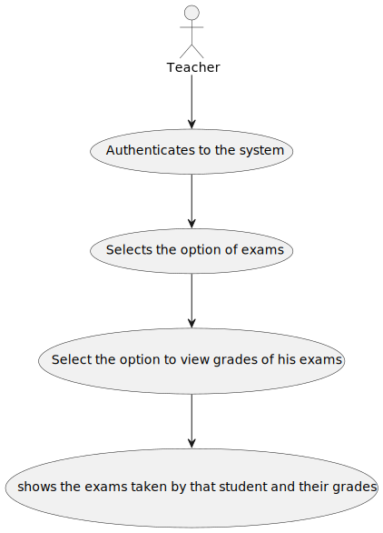
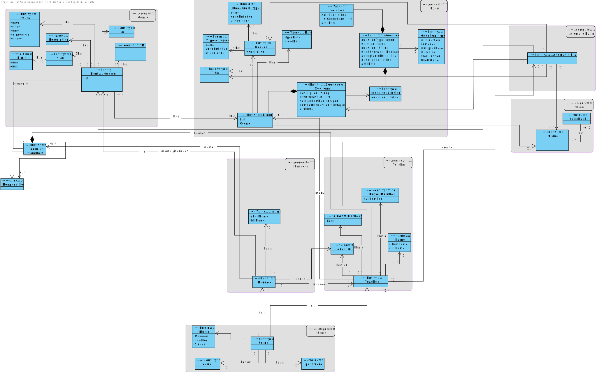
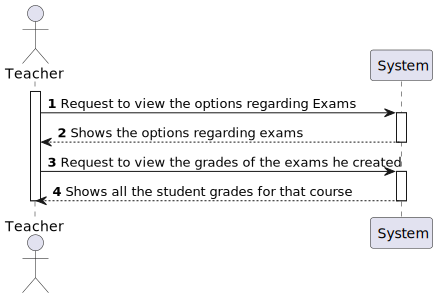
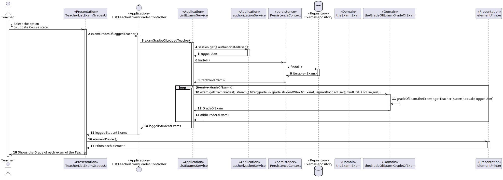
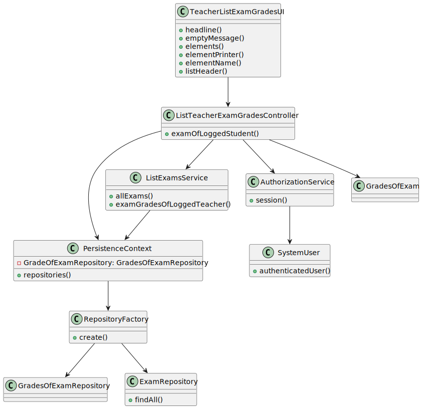

# US2006 - As Teacher, I want to view a list of the grades of exams of my courses

## 1. Requirements Engineering

### 1.1. User Story Description

The Teacher want to view the list of grades of exams of his courses.

### 1.2. Customer Specifications and Clarifications

**From the specifications document:**
* The Teacher want to view the list of grades of exams of his courses.

**From the client clarifications:**

> **Question**
> 
>Boa tarde,
Relativamente a esta user story, o ficheiro excel providenciado refere o seguinte:
"As Teacher, I want to view a list of the grades of exams of my courses"
Um professor deve conseguir ver as notas de um curso específico, de todos os seus cursos ao mesmo tempo, ou ambos?
Obrigado pela atenção,

>  **Answer**
>Boa tarde.
Penso que seria interessante ter todas as possibilidades que mencionou. Como sugestão, talvez apresentar os cursos do professor e este poder indicar quais os cursos que quer ver ou "todos".

> **Question**
>Bom dia,
As notas dos exames formativos tambem deveriam ser listadas? Ou apenas seriam listadas as notas dos exames "normais"

>  **Answer**
>Boa noite.
Os exames formativos são gerados automaticamente e, não existindo um registo das perguntas e respostas desses exames, não penso que faça sentido armazenar os resultados dessas notas.
No entanto, o sistema deve apresentar para estes exames o feedback e a nota no final.

### 1.3. Acceptance Criteria

* **FRE06:** The system displays the grades of a class (to a teacher of that course)

The user needs to be logged in the application as a Teacher.

### 1.4. Found out Dependencies

* There is a dependency to "US1001" - As Manager, I want to be able to register, disable/enable, and list users of the system (Teachers and Students, as well as Managers)
* There is a dependency to "US1002" - As Manager, I want to create courses
* There is a dependency to "US1003" - As Manager, I want to open and close enrollements in courses
* There is a dependency to "US1008" - As Student, I want to request my enrollment in a course
* There is a dependency to "US1009" - As Manager, I want to approve or reject students applications to courses
* There is a dependenct to "US2001" - As Teacher, I want to create/update an exam
* There is a dependency to "US2004" - As Student, I want to take an exam

### 1.5 Input and Output Data

**Input Data:**
-/

**Output Data:**

* Course Enrollment

### Analysis

* User Interface - This class is named ListExamsUI where it will allow the Student to view his exams grades
* Controller     - This class is named ListStudentExamGradesController where will be responsible for managing UI requests and performing the necessary actions to show the grades of the student
* Service        - ListExamsService prepare the list of all logged student exams

*Below is the use case diagram to show the interactions between the manager and the system

### 1.6. Domain Model

### 1.7. System Sequence Diagram (SSD)

### 1.8. Other Relevant Remarks

## 3. Design - User Story Realization

### 3.1. Rationale

| Interaction ID | Question: Which class is responsible for...            | Answer                          | Justification (with patterns)                                                                                                    |
|:---------------|:-------------------------------------------------------|:--------------------------------|:---------------------------------------------------------------------------------------------------------------------------------|
| Step 1         | ... interacting with the actor?                        | TeacherListExamGradesUI         | UI pattern: TeacherListExamGradesUI is responsible for interacting with the actor                                                |
|                | ... coordinating the US?                               | ListTeacherExamGradesController | Controller pattern: ListTeacherExamGradesController is responsible for coordinating the use case and invoking necessary classes. |
| Step 3         | ... Preparing the information about the Teacher grades | ListExamsService                | Service: ListExamsService is responsible for listing all the exam grades for the courses of the logged teacher                   |
| Step 4         | ... Retrieves the information of the logged Teacher    | AuthorizationService            | Service: AuthorizationService is responsible for retrieving the student logged in                                                |
| Step 7         | ... return the exams                                   | ExamsRepository                 | repository: ExamsRepository returns the Exams in the database                                                                    |
| Step 11        | ... return the grade of exams                          | GradeOfExamsRepository          | repository: GradeOfExamsRepository returns the GradeOfExams in the database                                                      |

### Systematization ##

software classes (i.e. Pure Fabrication) identified:

* ListTeacherExamGradesController
* ListExamsService

## 3.2. Sequence Diagram (SD)

## 3.3. Class Diagram (CD)

# 4. Tests

/-

# 5. Construction (Implementation)

### TeacherListExamGradesUI

    public class TeacherListExamGradesUI extends AbstractListUI {

        private final ListTeacherExamGradesController listExamsController = new ListTeacherExamGradesController();
    
    
        @Override
        public String headline() {
            return "List Exams";
        }
    
        @Override
        protected String emptyMessage() {
            return "No Exams available yet.\n";
        }
    
    
        @Override
        protected Iterable<GradeOfExam> elements() {
            return listExamsController.examGradesOfLoggedTeacher();
    
        }
    
        @Override
        protected Visitor<GradeOfExam> elementPrinter() {
            return new TeacherExamGradesPrinter();
        }
    
        @Override
        protected String elementName() {
            return "Exam";
        }
    
        @Override
        protected String listHeader() {
            return String.format("#  %-30s%-20s%-20s%-20s%-20s", "Course", "Exam Title", "Teacher", "Grade", "Student Name");
        }
    }

### ListTeacherExamGradesController

    public class ListStudentExamGradesController {
    
        private final ListExamsService service = new ListExamsService();
    
        public Iterable<Exam> allExams() {
    
            return service.allExams();
        }
    
        public Iterable<GradeOfExam> examGradesOfLoggedStudent() {
            return service.examGradesOfLoggedStudent();
        }
    }

### ListExamService

    public class ListExamsService {
    
        private static final AuthorizationService authz = AuthzRegistry.authorizationService();
    
        public Iterable<GradeOfExam> allExamGrades(){
            return PersistenceContext.repositories().gradesForExam().findAll();
        }
    
        public List<GradeOfExam> examGradesOfLoggedTeacher() {
            List<GradeOfExam> loggedTeacherExams = new ArrayList<>();
            SystemUser loggedUser = authz.session().get().authenticatedUser();
            for (GradeOfExam gradeOfExam : allExamGrades()) {
                if (gradeOfExam.theExam() != null && gradeOfExam.theExam().getTeacher().user().equals(loggedUser)) {
                    loggedTeacherExams.add(gradeOfExam);
                }
                if (gradeOfExam.theAutomaticExam() != null && gradeOfExam.theAutomaticExam().getTeacher().user().equals(loggedUser)) {
                    loggedTeacherExams.add(gradeOfExam);
                }
            }
            return loggedTeacherExams;
        }
    }

# 6. Integration and Demo
/-

# 7. Observations
/-

