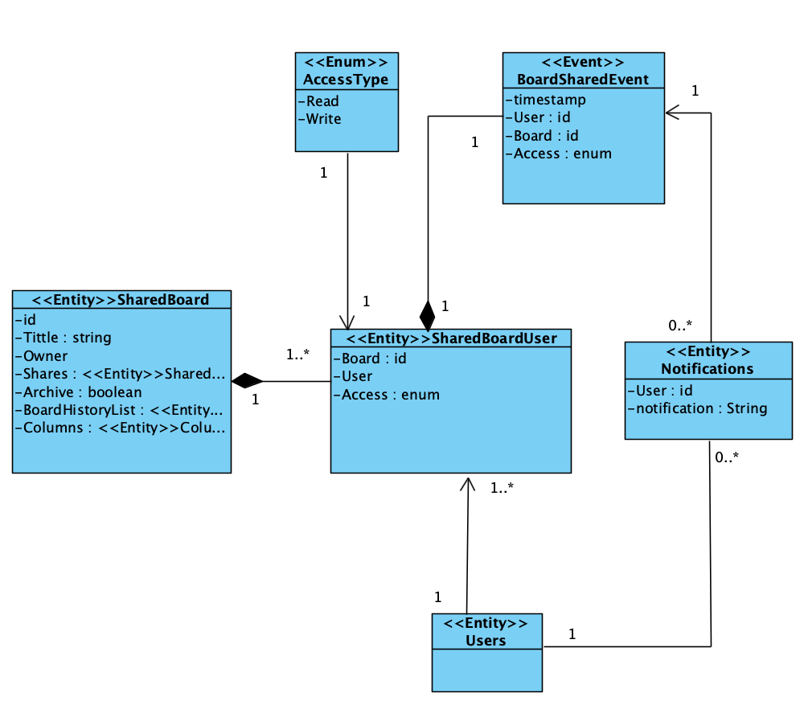
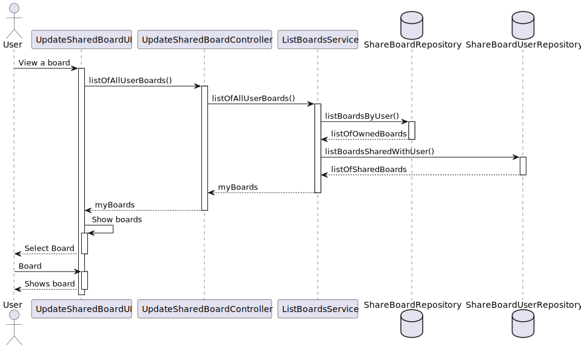
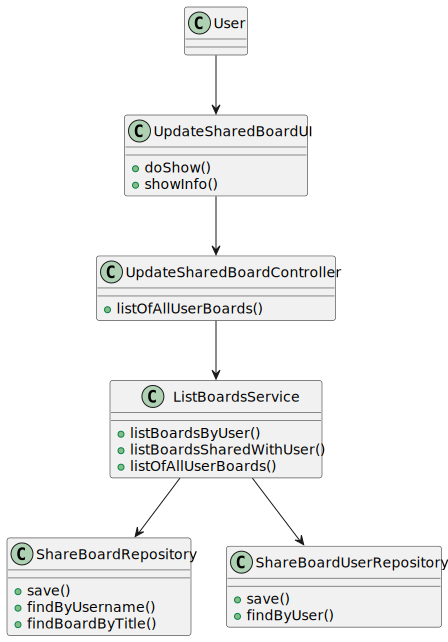

# US 3005 - As User, I want to view, in real-time, the updates in the shared boards

*This is an example template*

## 1. Context

*Explain the context for this task. It is the first time the task is assigned to be developed or this tasks was incomplete in a previous sprint and is to be completed in this sprint? Are we fixing some bug?*

This US allows the user with access to a shared board to view, in real-time, the updates of that board.
These updates may be made by other user, and only one user at a time may update the board. This way, it's assured that all user
have access to an updated board and no information is lost between updates.
When an update is done regarding the board, a notification must be sent to the users.
Only users with permissions to WRITE, may update the board.

## 2. Requirements

*In this section you should present the functionality that is being developed, how do you understand it, as well as possible correlations to other requirements (i.e., dependencies).*

**US3005** As User, I want to view, in real-time, the updates in the shared boards

-US3005.1 - This functional part of the system has very specific technical requirements, particularly some concerns about synchronization problems.
-US3005.2 - The solution design and implementation must be based on threads, condition variables and mutexes. Specific requirements will be provided in SCOMP.
-US3005.3 - The client app should implement an HTTP server to be able to generate the "views" of the boards. This should be done automatically, without the intervention of the users (i.e., without reload of the web page) by using AJAX.

- Dependencies:
    * US3001 - As Project Manager, I want the team to prepare the communication infrastructure for the Shared Boards and the deployment of the solution.
    * US3003 - As User, I want to create a board.
    * US3004 - As User, I want to share a board.

"Boards are one of the main used tools for teaching."
"The project aims to implement the concept of shared board, as a board that can be used to share and organize ideas and information."
"(...) several clients will try to concurrently update boards."
"There is a separation between a frontend (Shared Board App) and a backend (Shared Board Server)."
"The server implements the shared boards and receives updates from the clients." 
"As updates are executed in the server, the server notifies the clients of these updates."
"As such, all clients are able to maintain a "realtime" clone of the shared boards."
"The Shared Board App implements a "small" HTTP server that serves a page that displays a board view."

## 3. Analysis

*In this section, the team should report the study/analysis/comparison that was done in order to take the best design decisions for the requirement. This section should also include supporting diagrams/artifacts (such as domain model; use case diagrams, etc.),*

- At anytime, the application user (authorized) may want to view or update a board that he/she has access to.
For that matter, a repository for shareBoards and shareBoardsUsers needs to exist in others to assure the business domain and an abstraction 
layer between the domain code and the data storage.


**Input Data:**

* Selected data:
  * board.

* Typed data:
  * column(s),
  * row(s),
  * column name(s),
  * row name(s).

**Output Data:**

* an updated shared board.


**Domain Model Excerpt**




## 4. Design

*In this sections, the team should present the solution design that was adopted to solve the requirement. This should include, at least, a diagram of the realization of the functionality (e.g., sequence diagram), a class diagram (presenting the classes that support the functionality), the identification and rational behind the applied design patterns and the specification of the main tests used to validade the functionality.*


### 4.1. Realization


**System Sequence Diagram (SSD)**


**Rationale**

| Interaction ID                                                   | Question: Which class is responsible for... | Answer                      | Justification (with patterns)                                                                                   |
|:-----------------------------------------------------------------|:--------------------------------------------|:----------------------------|:----------------------------------------------------------------------------------------------------------------|
| Step 1 - Asks to update a board                                  | ... interacting with the actor?             | UpdateSharedBoardUI         | Pure Fabrication: there is no reason to assign this responsibility to any existing class in the Domain Model.   |
|                                                                  | ... coordinating the US?                    | UpdateSharedBoardController | Controller.                                                                                                     |
| Step 2 - Shows list of owned/shared boards                       | ... having the requested information?       | SharedBoardRepository AND   |                                                                                                                 |
|                                                                  |                                             | SharedBoardUserRepository   | Abstracts data access by providing an abstraction layer between the domain code and the data storage mechanism. |
|                                                                  | ... interacting with the actor?             | UpdateSharedBoardUI         | Pure Fabrication: there is no reason to assign this responsibility to any existing class in the Domain Model.   |
|                                                                  | ... managing the information?               | ListBoardsService           | Encapsulate a specific set of functionalities and allows for more manageable and incremental updates.           |
| Step 4 - Asks for the new board's information                    | ... interacting with the actor?             | UpdateSharedBoardUI         | Pure Fabrication: there is no reason to assign this responsibility to any existing class in the Domain Model.   |
| Step 6 - Creates a notification to users and saving the updates  | ... interacting with the actor?             | NotificationUI              | Pure Fabrication: there is no reason to assign this responsibility to any existing class in the Domain Model.   |
|                                                                  | ... creating the notification?              | BoardSharedEvent            | Low coupling.                                                                                                   |
|                                                                  | ... saving the update?                      | UpdateSharedBoardController | Controller.                                                                                                     |


**Sequence Diagram (SD)**





*Note* Factories, Persistence Context and other DDD domains weren't represented to lower the SD's complexity.

### 4.2. Class Diagram



### 4.3. Applied Patterns
    - Controller
    - Persistence Context
    - Repository Factory
    - Repository
    - Service
    - Event
    
### 4.4. Tests

**Test 1:** * Verifies that it is not possible to update a board with READ access type.
**Test 2:** * Verifies that it is possible to update the number of column in a board that the user as access.
**Test 3:** * Verifies that it is possible to update the number of row in a board that the user as access.
**Test 4:** * Verifies that it is possible to update the column name of a board that the user as access.
**Test 5:** * Verifies that it is possible to update the row name of a board that the user as access.
**Test 6:** * Verifies that a notification must be sent to all users with access to the board when the board is updated.
**Test 7:** * Verifies that only the owner of the board may archive the board.

```

   
````

## 5. Implementation

*In this section the team should present, if necessary, some evidencies that the implementation is according to the design. It should also describe and explain other important artifacts necessary to fully understand the implementation like, for instance, configuration files.*

*It is also a best practice to include a listing (with a brief summary) of the major commits regarding this requirement.*

N/A

## 6. Integration/Demonstration

*In this section the team should describe the efforts realized in order to integrate this functionality with the other parts/components of the system*

*It is also important to explain any scripts or instructions required to execute an demonstrate this functionality*

N/A

## 7. Observations

*This section should be used to include any content that does not fit any of the previous sections.*

*The team should present here, for instance, a critical prespective on the developed work including the analysis of alternative solutioons or related works*

*The team should include in this section statements/references regarding third party works that were used in the development this work.*

N/A