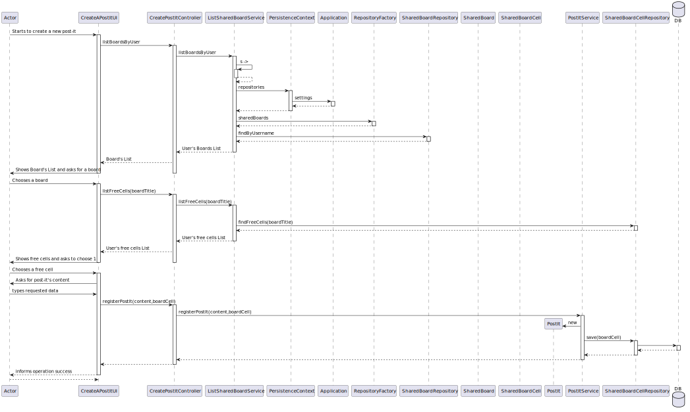
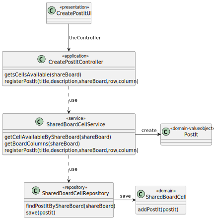

# US 3006  : As a User I want to create a post-it-on a board.

## 1. Requirements Engineering

### 1.1. User Story Description

As a User, I want to create a post-it-on a board

**From the specifications document:**

* "shared board is a digital implementation of a post-it board. It has a unique
  title. It is divided into a certain number of columns and rows."

* "Users with write permission may post content to a cell in the board."

* "When the server commits a post it also should notify all clients with access
  to the board of the update. "

**From the client clarifications:**

> **Question:**
> **Answer:**
> 
>
### 1.4. Found out Dependencies

* [US-3002] "Create a Board"
* [US-3005] "Share a Board"

### 1.5 Input and Output Data

**Input Data:**
* Selected data
* A board on which the user has write permission
* A cell on the board

**Typed Data:**
* Post-it content (text or image)

## 3. Analysis

A user creates a post-it on a board. 
The user with write permission can add content to a specific cell on the board.

* The system shows the shared boards where the user has write permission.
* The user selects the shared board on which he wants to create a post-it.


* The system retrieves the free cells on the board.
* The user selects the specific cell on the board where they want to place the post-it.


* The user specifies the content they want to add to the post-it.
* *The system posts the post-it on the board.


### 1.6. System Sequence Diagram (SSD)


### 1.7 Other Relevant Remarks

*

## 2. OO Analysis

### 2.1. Relevant Domain Model Excerpt


## 3. Design - User Story Realization

*In this sections, the team should present the solution design that was adopted to solve the requirement. This should include, at least, a diagram of the realization of the functionality (e.g., sequence diagram), a class diagram (presenting the classes that support the functionality), the identification and rational behind the applied design patterns and the specification of the main tests used to validade the functionality.*

**SSD**

### Systematization ##

The conceptual classes promoted to software classes are:
Shared Board (Entity)
Shared Board Line Titles (Value Object)
Shared Board Column Titles (Value Object)
Shared Board Cell (Entity)
Post-it (Value Object)

Other software classes (i.e. Pure Fabrication) identified:

* UserStoryUI
* UserStoryController
* Builder
* Repository
* Service


## 3.2. Sequence Diagram (SD)



## 3.3. Class Diagram (CD)




### 4.4. Tests

* Verify Successful Creation of a Post-it on a Board
``` 
A user can successfully create a post-it on a board.
```

* Verify Proper Placement of Post-it on the Board
```
The post-it is placed correctly in the selected cell on the board.
```
* Verify Concurrent Post-it Creation
```
The system handles concurrent post-it creations by multiple users.
```
* Verify Non-Empty Post-it Content
```
An IllegalArgumentException is thrown when trying to create a post-it with an empty title.
```

**Test 7:** Verify Non-Null Boardrow

```
An IllegalArgumentException is thrown when trying to create a post-it with a null BoardRow.
```

**Test 7:** Verify Non-Null Boardcolumn

```
An IllegalArgumentException is thrown when trying to create a post-it with a null BoardColumn.
```


# 5. Construction (Implementation)


## Class


## Class


# 6. Integration and Demo


# 7. Observations
