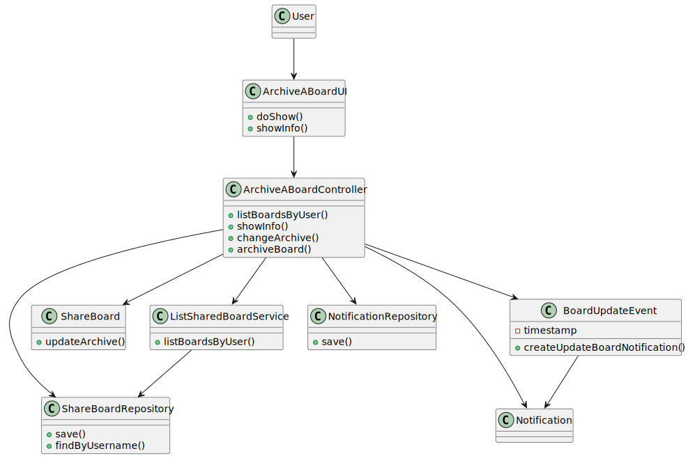

# US 3010 - As User, I want to archive a board I own

*This is an example template*

## 1. Context

*Explain the context for this task. It is the first time the task is assigned to be developed or this tasks was incomplete in a previous sprint and is to be completed in this sprint? Are we fixing some bug?*

This US allows the owner of a board to archive it.
Only the owner of the board may archive the board. The other users, even if they have WRITE access to that board,
shouldn't be able to archive the board.
When a board is archived, a notification must be sent to the users with whom the owner shared the board.


## 2. Requirements

*In this section you should present the functionality that is being developed, how do you understand it, as well as possible correlations to other requirements (i.e., dependencies).*

**US3010** As User, I want to archive a board I own

-US3010.1 - This functional part of the system has very specific technical requirements, particularly some concerns about synchronization problems.
-US3010.2 - The solution design and implementation must be based on threads, condition variables and mutexes. Specific requirements will be provided in SCOMP.

- Dependencies:
    * US3001 - As Project Manager, I want the team to prepare the communication infrastructure for the Shared Boards and the deployment of the solution.
    * US3003 - As User, I want to create a board.

### System Specification
"The owner of a board can archive the board"
"The owner of a board can archive the board when it will no longer be used."
"The project aims to implement the concept of shared board, as a board that can be used to share and organize ideas and information."
"There is a separation between a frontend (Shared Board App) and a backend (Shared Board Server)."
"The server implements the shared boards and receives updates from the clients." 
"As updates are executed in the server, the server notifies the clients of these updates."

### Client Specification
N/A

## 3. Analysis

*In this section, the team should report the study/analysis/comparison that was done in order to take the best design decisions for the requirement. This section should also include supporting diagrams/artifacts (such as domain model; use case diagrams, etc.),*

- At anytime, the application user (authorized) may want archive a board that he/she owns.
For that matter, a repository for shareBoards needs to exist in other to assure the business domain and an abstraction 
layer between the domain code and the data storage.


**Input Data:**

* Selected data:
  * board.

**Output Data:**
* an archived board.


**Domain Model Excerpt**


## 4. Design

*In this sections, the team should present the solution design that was adopted to solve the requirement. This should include, at least, a diagram of the realization of the functionality (e.g., sequence diagram), a class diagram (presenting the classes that support the functionality), the identification and rational behind the applied design patterns and the specification of the main tests used to validade the functionality.*


### 4.1. Realization


**System Sequence Diagram (SSD)**


**Rationale**

| Interaction ID                   | Question: Which class is responsible for... | Answer                  | Justification (with patterns)                                                                                   |
|:---------------------------------|:--------------------------------------------|:------------------------|:----------------------------------------------------------------------------------------------------------------|
| Step 1 - Asks to archive a board | ... interacting with the actor?             | ArchiveABoardUI         | Pure Fabrication: there is no reason to assign this responsibility to any existing class in the Domain Model.   |
|                                  | ... coordinating the US?                    | ArchiveABoardController | Controller.                                                                                                     |
| Step 2 - Shows list of boards    | ... having the requested information?       | SharedBoardRepository   | Abstracts data access by providing an abstraction layer between the domain code and the data storage mechanism. |
|                                  | ... managing the information?               | ListBoardsService       | Encapsulate a specific set of functionalities and allows for more manageable and incremental updates.           |
| Step 3 - Selects the board       | ... interacting with the actor?             | ArchiveABoardUI         | Pure Fabrication: there is no reason to assign this responsibility to any existing class in the Domain Model.   |
| Step 4 - Archiving the board     | ... validates user's permission?            | SharedBoard             | IE, knows who the board owner is and if it's already archived.                                                  |
|                                  | ... creating the notification?              | BoardUpdateEvent        | Low coupling.                                                                                                   |
|                                  | ... saving the board?                       | ArchiveABoardController | Controller.                                                                                                     |


**Sequence Diagram (SD)**


*Note* Factories, Persistence Context and other DDD domains weren't represented to lower the SD's complexity.

### 4.2. Class Diagram



### 4.3. Applied Patterns
    - Controller
    - Persistence Context
    - Repository Factory
    - Repository
    - Service
    - Event
    
### 4.4. Tests

**Test 1:** * Verifies that only the owner of the board may archive the board.
**Test 2:** * Verifies that it's not possible to archive an already archived board.

```

   
````

## 5. Implementation

*In this section the team should present, if necessary, some evidencies that the implementation is according to the design. It should also describe and explain other important artifacts necessary to fully understand the implementation like, for instance, configuration files.*

*It is also a best practice to include a listing (with a brief summary) of the major commits regarding this requirement.*

N/A

## 6. Integration/Demonstration

*In this section the team should describe the efforts realized in order to integrate this functionality with the other parts/components of the system*

*It is also important to explain any scripts or instructions required to execute an demonstrate this functionality*

N/A

## 7. Observations

*This section should be used to include any content that does not fit any of the previous sections.*

*The team should present here, for instance, a critical prespective on the developed work including the analysis of alternative solutioons or related works*

*The team should include in this section statements/references regarding third party works that were used in the development this work.*

N/A