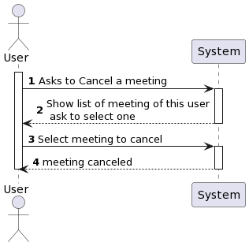
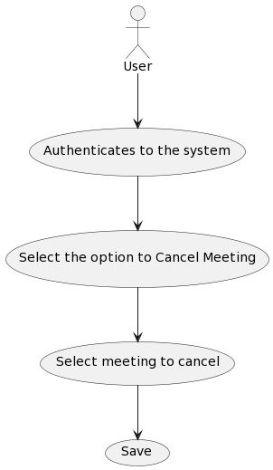
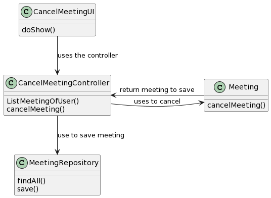

# US4002 As User, I want to cancel a meeting

## 1. Context

*In the application it is necessary to have a way to Cancel meetings after they are scheduled.
This US responds to that need*

## 2. Requirements

*Only the creator of the meeting can cancel his meetings.
For this he needs to be logged into the application first.
He needs to have meetings created and in booked status.
Then he can cancel these meetings.
It should not be possible to cancel the same meeting twice.
Dont exist answer of cliente for more clarification*

## 3. Analysis
#### US4002 As User, I want to cancel a meeting
This is a simple user story that just fetches the meeting objects
objects of the user who is logged in and shows the scheduled ones.
The user chooses a scheduled meeting and cancels it.
This meeting will no longer appear in the list of scheduled meetings and will be
cancelled.

Here is an SSD and UC to explain the flow.

## System sequence diagram

## Use case diagram

*Rational*

| Interaction ID | Question: Which class is responsible for... | Answer                                       | Justification (with patterns)                                               |
|:---------------|:--------------------------------------------|:---------------------------------------------|:----------------------------------------------------------------------------|
| Step 1         | ... interacting with the actor?             | CancelMeetingUI                              | UI layer interacts with the user, following the UI pattern.                 |
|                | ... coordinating the US?                    | CancelMeetingController                      | Controller handles the use case, following the Application pattern.         |                                                                                                          |                                                           |
| Step 2         | Saving the Meeting                          | CancelMeetingController / PersistenceContext | Controller collaborates with the PersistenceContext to persist the Meeting. |
| Step 3         | show meeting information for user           | CancelMeetingUI                              | UI layer displays the meeting information to the user.                      |
| Step 4         | .. cancel the meeting                       | CancelMeetingController / meeting            | 
| Step 5         | .. show list of meeting of user             | ListMeetingsService                          |

## 4. Design

## Class diagram

## Sequence diagram

### 4.2. Applied Patterns

*UI Pattern*
*Application patters (controller)*
*Domain Service*
*Persistence patterns*

### 4.4. Tests

### test1
**onlyIsPossiblCancelScheduleMeetings()**

### test2
**meetingIsCanceled()**

### test3
**canceledMeetingsDontAppearsForCancel()**

## 7. Observations

