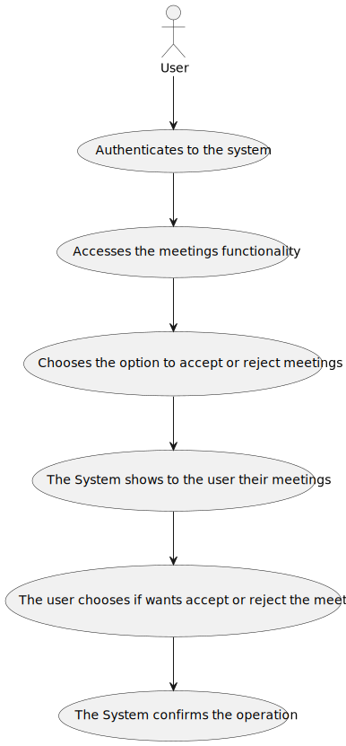
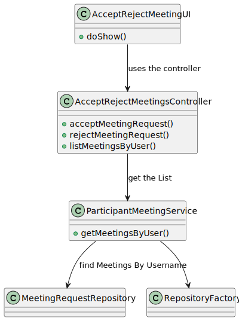
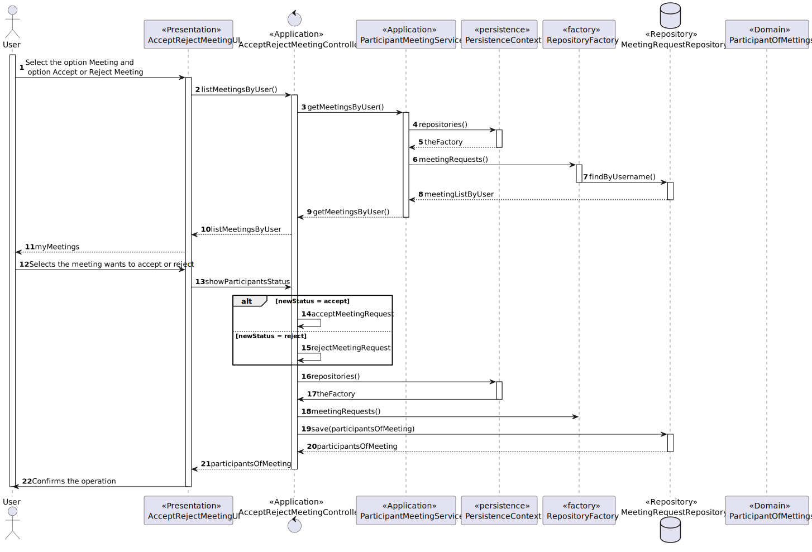

# US 4003 - As User, I want to accept or reject a meeting request

## 1. Context

*The context for this task is the development of a new feature requested by the costumer. The purpose of this user story is to allow user to view a list of participants in my meeting and their status (accept or reject).*

### 1.1. Customer Specifications and Clarifications
**From the client clarifications:**
>- **Question**:
   Em relação a esta US deveríamos simplesmente considerar os "meeting request" que não foram aceites ou rejeitados?
   Um "meeting request" que já foi aceite ou rejeitado poderá ser alterado, depois?
>- **Answer** :
   a intenção nesta US é fazer exactamente o que está descrito: aceitar ou rejeitar um pedido de reunião. A decisão é tomada uma única vez pelo utilizador.

## 2. Requirements

*The requirement is to develop the functionality for view a list of participants in a meeting . This user story is a new feature that has not been implemented before and depends on the implementation of US4001 As User, I want to schedule a meeting and US*

**US 4003** As User, I want to accept or reject a meeting request
1. The User authenticates in the system.
2. The User accesses the meetings functionality.
3. The User chooses the option to accept or reject a meeting request.
4. The User chooses the Pending Meeting what wants to accept or reject a meeting request
5. The user chooses the option ACCEPT or REJECT the meeting request.
6. The system confirms the operation.

## 3. Analysis
In this section, the team should report the study/analysis/comparison that was done in order to take the best design decisions for the requirement. This section should also include supporting diagrams/artifacts (such as domain model; use case diagrams, etc.),

- At anytime, the user may want to view the list of participants and status in their meetings.

- There have a dependency to US4001.

**Input Data:**

* Typed data:
    * N/A

* Selected data:
    * Meeting

**Output Data:**

* Meetings by user

Below is the use case diagram to show the interactions between the user and the system when open and close courses*

## 4. Design

*In this sections, the team should present the solution design that was adopted to solve the requirement. This should include, at least, a diagram of the realization of the functionality (e.g., sequence diagram), a class diagram (presenting the classes that support the functionality), the identification and rational behind the applied design patterns and the specification of the main tests used to validade the functionality.*

### 4.1. Realization

| Interaction ID | Question: Which class is responsible for...         | Answer                                                         | Justification (with patterns)                                                                                                  |
|:---------------|:----------------------------------------------------|:---------------------------------------------------------------|:-------------------------------------------------------------------------------------------------------------------------------|
| Step 1         | ... interacting with the actor?                     | AcceptRejectMeetingUI                                          | UI pattern: UpdateCourseState is responsible for interacting with the actor to shows the list of the meetings.                 |
|                | ... coordinating the US?                            | AcceptRejectMeetingUIController                                | Controller pattern: AcceptRejectMeetingController is responsible for coordinating the use case and invoking necessary classes. |
| Step 2         | ... return list of meetings                         | MeetingRequestRepository                                       | Repository pattern: MeetingsRepository is responsible for retrieving the list of meetings from the database.                   |
| Step 3         | ... show the meetings to the user                   | AcceptRejectMeetingUI                                          | UI pattern: ListMeetingsUI is responsible for presenting the meetings to the user.                                             |
| Step 4         | ... Validate User                                   | AppSettings                                                    | Settings pattern: AppSettings is responsible for validating if the user is valid based on application settings.                |
| Step 5         | ... get list of the meetings by user                | ParticipantMeetingService                                      |                                                                                                                                |
| Step 6         | ... update Status of the meeting (Accept or reject) | AcceptRejectMeetingUIController                                |                                                                                                                                |

### 4.2. Class Diagram

### 4.3 Sequence Diagran

### 4.4. Applied Patterns
    - Controller
    - Service
    - Persistence Context
    - Repository

### 4.5. Tests
* Check if the meeting request can be accepted or rejected when the meeting status is Pending
* Check if the order status is updated correctly after the accept or reject action.

## 5. Implementation

*In this section the team should present, if necessary, some evidencies that the implementation is according to the design. It should also describe and explain other important artifacts necessary to fully understand the implementation like, for instance, configuration files.*

*It is also a best practice to include a listing (with a brief summary) of the major commits regarding this requirement.*

## 6. Integration/Demonstration

*In this section the team should describe the efforts realized in order to integrate this functionality with the other parts/components of the system*

*It is also important to explain any scripts or instructions required to execute an demonstrate this functionality*

## 7. Observations

*This section should be used to include any content that does not fit any of the previous sections.*

*The team should present here, for instance, a critical prespective on the developed work including the analysis of alternative solutioons or related works*

*The team should include in this section statements/references regarding third party works that were used in the development this work.*